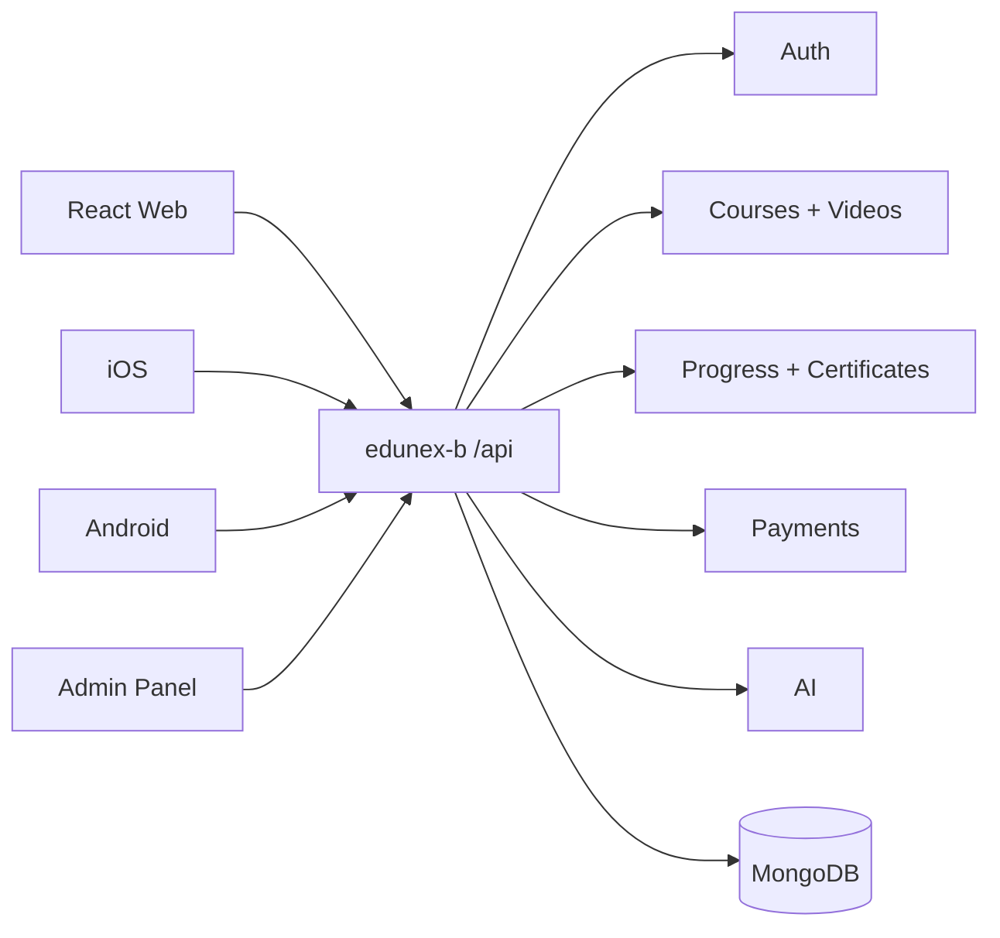
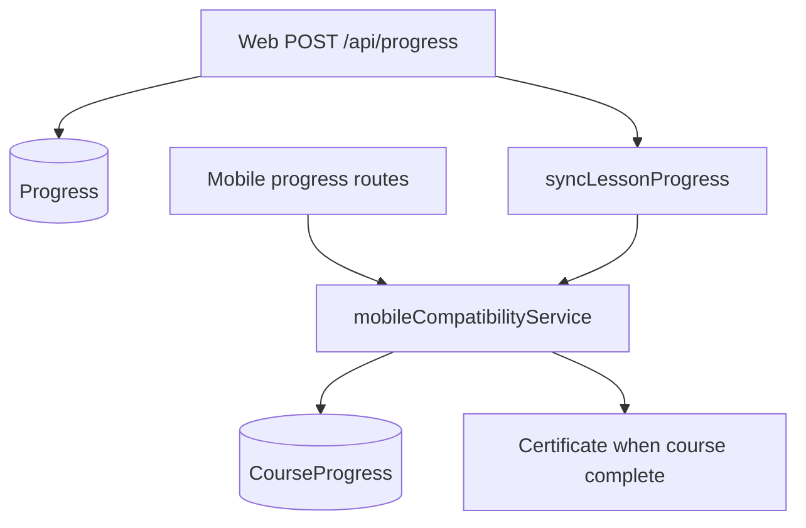
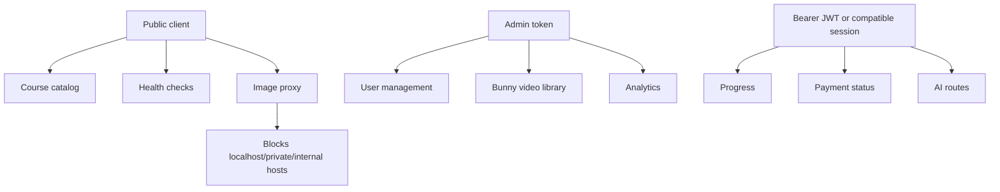

# EduNex Backend Route Contracts

This file is the working contract for connecting React web, iOS, Android, and admin clients to the unified `edunex-b` backend.

## Client Map



## Auth Standard

New clients should use Bearer JWT:

```http
Authorization: Bearer <accessToken>
```

Legacy mobile compatibility routes can also accept:

```txt
userId + sessionId
```

Those values may be sent in query/body where the old mobile app already sends them.

Session behavior during migration:

- Login/signup returns `accessToken`, `refreshToken`, `sessionId`, and `user`.
- Refresh tokens are tied to the current session id.
- `POST /api/auth/logout` logs out the current session/device.
- `POST /api/auth/logout-all` revokes every session for that user.
- Clients should send `x-platform: web`, `x-platform: ios`, or `x-platform: android` where possible.
- Clients can call `PATCH /api/sessions/ping` after login to keep device activity fresh.

## React Web Routes

| Flow | Method | Path | Auth | Notes |
| --- | --- | --- | --- | --- |
| Health | `GET` | `/api/health` | No | API process check. |
| DB health | `GET` | `/api/health/db` | No | MongoDB readiness check. |
| Send OTP | `POST` | `/api/auth/send-mobile-otp` | No | Body: `mobileNumber`. |
| Verify OTP | `POST` | `/api/auth/verify-mobile-otp` | No | Body: `mobileNumber`, `mobileOtp`. |
| Signup | `POST` | `/api/auth/signup` | No | Uses `signupToken`. |
| Login | `POST` | `/api/auth/login` | No | Body: `loginId` or `mobileNumber`, `password`. |
| Current user | `GET` | `/api/auth/me` | JWT | Profile/session check. |
| Update profile | `PATCH` | `/api/auth/me` | JWT | Profile fields/avatar. |
| Active sessions | `GET` | `/api/auth/sessions` | JWT | Lists active devices without exposing raw session ids. |
| Refresh token | `POST` | `/api/auth/refresh` | No | Body: `refreshToken`. |
| Logout | `POST` | `/api/auth/logout` | JWT | Ends current session. |
| Logout all | `POST` | `/api/auth/logout-all` | JWT | Revokes all sessions for the user. |
| Courses | `GET` | `/api/courses` | No | Public course catalog. |
| Course lessons | `GET` | `/api/courses/:id/lessons` | JWT + subscription | Course video list. |
| Lesson | `GET` | `/api/lessons/:id` | JWT + subscription | Single lesson/video. |
| Progress list | `GET` | `/api/progress` | JWT + subscription | Existing web progress shape. |
| Progress write | `POST` | `/api/progress` | JWT + subscription | Also syncs unified `CourseProgress`. |
| Wishlist | `GET` | `/api/wishlist` | JWT | Current web wishlist. |
| Wishlist toggle | `POST` | `/api/wishlist/toggle` | JWT | Body: `courseId`. |
| Subscription status | `GET` | `/api/payment/subscription-status` | JWT | Payment/subscription state. |
| AI chat | `POST` | `/api/ai/chat` | JWT | Nex AI chat. |

## Mobile Compatibility Routes

| Flow | Method | Path | Auth | Notes |
| --- | --- | --- | --- | --- |
| Validate session | `GET` | `/api/auth/validate/:id` | JWT or session | Returns `valid`, `user`, `wishlist`. |
| Subscription | `GET` | `/api/user/:id/subscription` | JWT or session | Old mobile response shape. |
| Wishlist toggle | `POST` | `/api/user/wishlist/toggle` | JWT or session | Body: `userId`, `courseId`. |
| User progress | `GET` | `/api/user/:id/progress` | JWT or session | Returns `courseProgress`. |
| Update video progress | `POST` | `/api/user/progress/update-video` | JWT or session | Body: `userId`, `courseId`, `videoId`, `currentTime`, `duration`. |
| Complete video | `POST` | `/api/user/progress/complete-video` | JWT or session | Body: `userId`, `courseId`, `videoId`. |
| Certificates | `GET` | `/api/user/:id/certificates` | JWT or session | User certificates. |
| Top courses | `GET` | `/api/courses/top` | No | Public mobile home route. |
| Most watched video | `GET` | `/api/videos/most-watched` | JWT or session | Requires subscription. |
| Course videos | `GET` | `/api/courses/:id/videos` | JWT or session | Requires subscription. |
| Avatar update | `PATCH` | `/api/user/:id/avatar` | JWT or session | Body: `avatar`. |
| Bunny thumbnail | `GET` | `/api/bunny/thumbnail/:guid` | No | Redirects to thumbnail when found. |
| Bunny download | `GET` | `/api/videos/:guid/download` | JWT or session | Requires subscription. |
| Course AI | `POST` | `/api/course-ai/chat` | JWT or session | Proxies to `AI_SERVER_URL`. |

## Admin Routes

| Flow | Method | Path | Auth | Notes |
| --- | --- | --- | --- | --- |
| Admin login | `POST` | `/api/admin/login` | Password | Returns admin token. |
| Analytics | `GET` | `/api/admin/analytics` | Admin JWT | Dashboard metrics. |
| Users | `GET` | `/api/admin/users` | Admin JWT | Admin user list. |
| User management | `GET` | `/api/admin/user-management` | Admin JWT | Detailed user/progress view. |
| Courses | `GET` | `/api/admin/courses` | Admin JWT | Admin course list. |
| Update course | `PATCH` | `/api/admin/courses/:id` | Admin JWT | Course editor. |
| Delete course | `DELETE` | `/api/admin/courses/:id` | Admin JWT | Deletes course and related rows. |
| Course progress | `GET` | `/api/admin/course-progress` | Admin JWT | Old mobile/admin compatibility. |
| Bunny video library | `GET` | `/api/bunny/videos` | Admin JWT | Lists Bunny videos for admin course setup. |

## Progress Model During Migration



Current state:

- Web reads can still use `GET /api/progress`.
- Mobile reads can use `GET /api/user/:id/progress`.
- Both web and mobile writes now feed the shared course progress path.

## Safety Rules



- `/api/users` is admin-only.
- `/api/bunny/videos` is admin-only.
- Admin login is rate-limited.
- Production refuses to start with `AUTO_VERIFY_OTP=true`.
- Production refuses to start with `DISABLE_AUTH_RATE_LIMIT=true`.
- `/api/image-proxy` blocks local/private/internal network targets and can use `IMAGE_PROXY_ALLOWED_HOSTS`.

## Smoke Testing

Local no-DB route-load check:

```sh
npm run smoke:api:local
```

Real DB/staging check:

```sh
SMOKE_API_BASE_URL=http://127.0.0.1:3000 npm run smoke:api
```

Real DB check using a separate env file path:

```sh
SMOKE_ENV_PATH=/path/to/backend.env npm run smoke:api -- --start
```

Use a staging/test database for this command. Do not point smoke tests at a production database unless you explicitly intend to test production and have disabled background jobs.

Full authenticated check:

```sh
SMOKE_API_BASE_URL=https://your-api.example.com \
SMOKE_LOGIN_ID=learner@example.com \
SMOKE_PASSWORD=secret \
SMOKE_COURSE_ID=<courseId> \
SMOKE_LESSON_ID=<lessonId> \
SMOKE_VIDEO_ID=<videoId> \
SMOKE_ADMIN_PASSWORD=<adminPassword> \
npm run smoke:api
```
