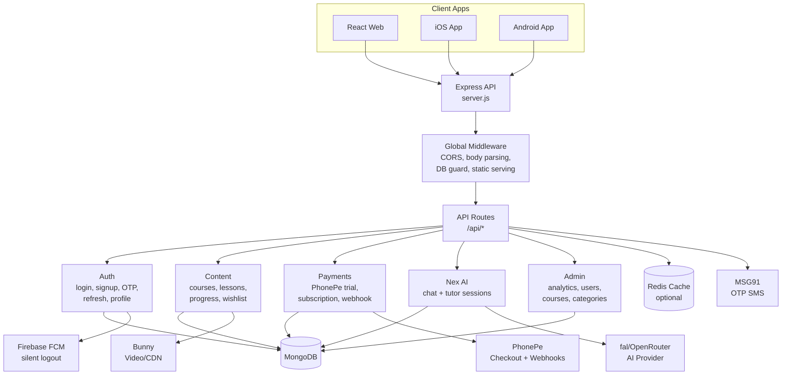
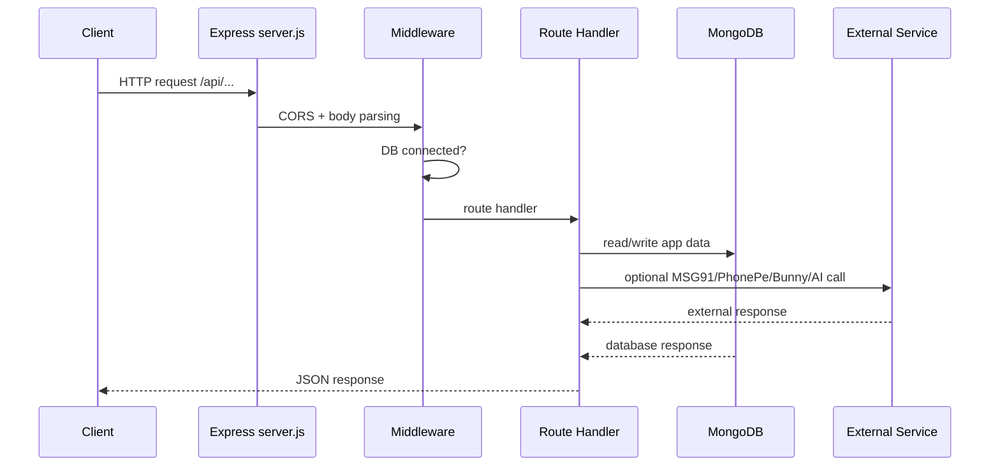
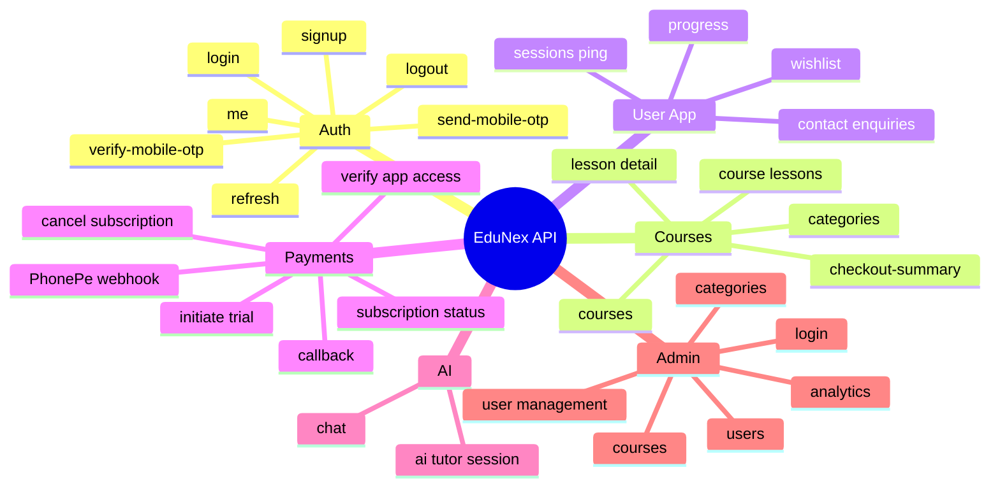
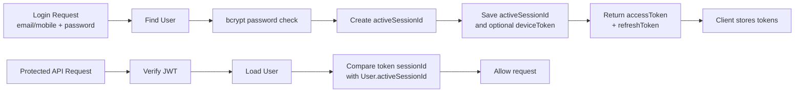
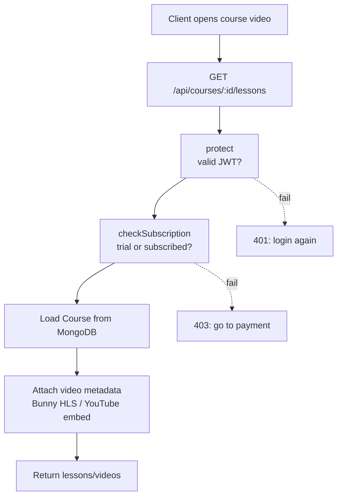
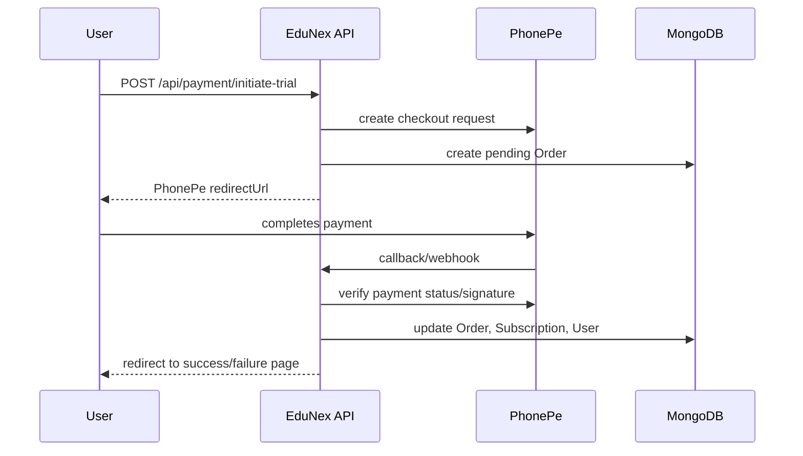
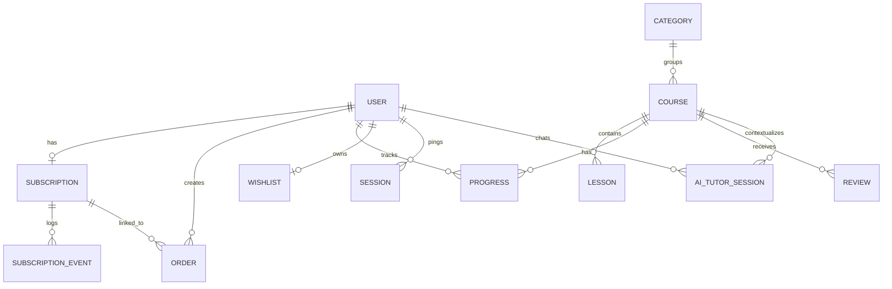
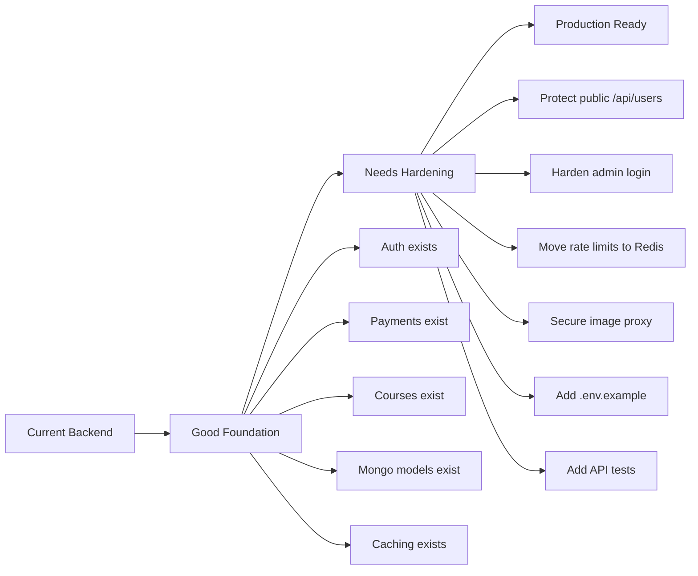

# EduNex Backend Architecture Visual

This is the quick visual map of the current `edunex-b` backend.

## 1. Big Picture



## 2. Backend Layers

```txt
server.js
  |
  +-- Config
  |     .env / .env.local
  |     production env checks
  |
  +-- Express middleware
  |     CORS
  |     JSON parser
  |     raw PhonePe webhook parser
  |     MongoDB connection guard
  |
  +-- Security middleware
  |     protect
  |     protectAdmin
  |     checkSubscription
  |
  +-- Routes
  |     auth
  |     courses/categories
  |     lessons/progress
  |     wishlist
  |     payment
  |     AI
  |     admin
  |
  +-- Services
  |     OTP
  |     PhonePe
  |     cache
  |     push notifications
  |
  +-- Models
        User, Course, Subscription, Order, Wishlist, Progress, etc.
```

## 3. Request Flow



## 4. Main API Map



## 5. Auth Flow



Current behavior:

```txt
One user = one active session.
New login invalidates the old login.
```

## 6. Course Access Flow



## 7. Payment Flow



## 8. Device Behavior

| Device | Login API | Session Ping | Device Token | Special Behavior |
| --- | --- | --- | --- | --- |
| Web | `POST /api/auth/login` | defaults to `web` | usually none | Uses bearer token. New mobile login invalidates old web token. |
| Android | `POST /api/auth/login` | `platform=android` | FCM token | Can receive silent logout push. |
| iOS | `POST /api/auth/login` | `platform=ios` | FCM/APNs-backed token | Can receive APNs background silent logout. |

Supported session platforms:

```txt
web
ios
android
windows
macos
```

## 9. Data Model Map



## 10. Frontend Connection

Local development:

```txt
React/Vite frontend
http://localhost:5173
        |
        | /api proxy
        v
EduNex backend
http://localhost:3000
```

Production:

```txt
CDN/static frontend
        |
        | /api
        v
Reverse proxy / load balancer
        |
        v
EduNex API instances
        |
        +-- MongoDB
        +-- Redis
        +-- PhonePe
        +-- MSG91
        +-- Bunny
        +-- Firebase
        +-- AI provider
```

React should call same-origin paths:

```js
fetch("/api/auth/login")
fetch("/api/courses")
fetch("/api/payment/subscription-status")
fetch("/api/wishlist")
fetch("/api/ai/chat")
```

## 11. Current Production Readiness



## 12. Best Next Architecture Upgrade

Current session model:

```txt
User
  activeSessionId
  deviceToken
```

Better multi-device model:

```txt
User
  |
  +-- Session: web
  |     refreshTokenHash
  |     lastPingAt
  |     revokedAt
  |
  +-- Session: android
  |     deviceToken
  |     refreshTokenHash
  |     lastPingAt
  |     revokedAt
  |
  +-- Session: ios
        deviceToken
        refreshTokenHash
        lastPingAt
        revokedAt
```

Why this matters:

- Web and mobile can stay logged in together.
- Logout can target one device.
- Refresh tokens can rotate per device.
- Silent logout can target only the old mobile device.
- `logout all devices` remains possible.
