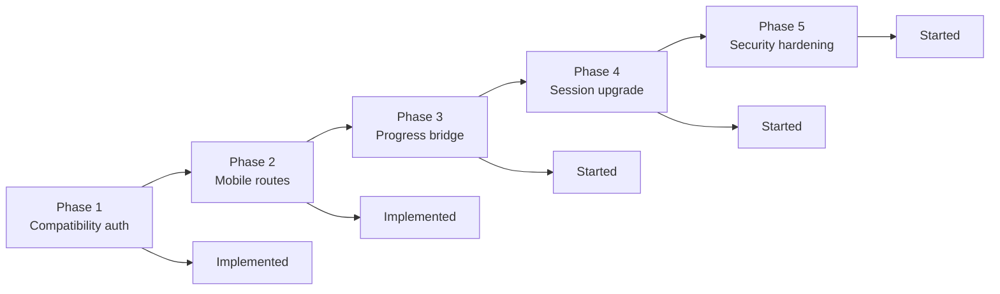

# EduNex Backend Migration Status

Updated: September 1, 2026

## Final Status

The backend migration foundation is implemented in `edunex-b`.

`edunex-b` is now the correct base for a unified backend for:

- React web
- iOS
- Android
- Admin
- Payments
- Videos
- AI

## Completed



### Phase 1

- Added compatibility auth for current Bearer JWTs and old mobile `userId + sessionId`.
- Kept existing protected routes on the normal auth path.

### Phase 2

- Added old mobile compatibility routes for session validation, subscription, wishlist, progress, certificates, course videos, Bunny thumbnail/download, course AI, top courses, most-watched video, and admin course progress.

### Phase 3

- Existing web `POST /api/progress` still returns its old response.
- The same call now also syncs into `CourseProgress`.
- Course completion can now create certificates through the shared service.

### Phase 4

- Session records now store `sessionId`, platform/device metadata, refresh token hash, IP/user-agent, and logout state.
- Login/signup persist session records.
- Refresh tokens are tied to the session id.
- Logout revokes the current session.
- Logout-all revokes every session for the current user.
- Session ping updates the current session record.

### Phase 5

- `/api/users` is admin-protected.
- `/api/bunny/videos` is admin-protected.
- Admin login is rate-limited.
- Production OTP uses MSG91.
- Production refuses to start with dev OTP enabled.
- Production refuses to start with auth rate limits disabled.
- Image proxy blocks localhost/private/internal targets.
- Background jobs can be disabled during smoke tests with `DISABLE_BACKGROUND_JOBS=true`.

## Tests Run

```txt
PASS node --check server.js
PASS node --check routes/auth.js
PASS node --check routes/sessions.js
PASS node --check routes/content.js
PASS node --check routes/mobileCompat.js
PASS node --check middleware/auth.js
PASS node --check middleware/compatAuth.js
PASS node --check models/Session.js
PASS node --check models/Certificate.js
PASS node --check services/mobileCompatibilityService.js
PASS node --check scripts/smoke-api.mjs
PASS package.json parse check
PASS git diff --check
PASS npm run smoke:api:local
PASS production guard rejects AUTO_VERIFY_OTP=true
PASS production guard rejects DISABLE_AUTH_RATE_LIMIT=true
PASS OTP service uses development mode locally
PASS OTP service rejects production send/verify when MSG91_AUTH_KEY is missing
PASS backend .env smoke connected to MongoDB
PASS backend .env smoke returned public courses and categories
```

The local smoke test confirmed:

- `/api/health` responds.
- DB unavailable state is handled cleanly.
- Anonymous `/api/bunny/videos` is rejected.
- Wrong admin login is rejected.
- Image proxy blocks private localhost targets.

The backend `.env` smoke test confirmed:

- MongoDB connected.
- `/api/courses` returned course data.
- `/api/categories` returned category data.
- Anonymous Bunny video library access is blocked.
- Bad admin login is blocked.
- Image proxy private target is blocked.

## Not Fully Verified Yet

These checks need a real staging/test database and test credentials:

- `POST /api/auth/login`
- `GET /api/auth/me`
- `GET /api/auth/sessions`
- `GET /api/auth/validate/:id`
- `GET /api/user/:id/subscription`
- `GET /api/user/:id/progress`
- `GET /api/payment/subscription-status`
- `GET /api/courses/:id/videos`
- `POST /api/user/progress/update-video`
- `POST /api/progress`
- `POST /api/admin/login`
- `GET /api/admin/course-progress`

## Required To Finish Real Endpoint Verification

Use a staging/test backend env file, not frontend env secrets:

```sh
SMOKE_ENV_PATH=/path/to/backend-staging.env npm run smoke:api -- --start
```

For authenticated route coverage, set:

```sh
SMOKE_LOGIN_ID=
SMOKE_PASSWORD=
SMOKE_COURSE_ID=
SMOKE_LESSON_ID=
SMOKE_VIDEO_ID=
SMOKE_ADMIN_PASSWORD=
```

Do not run mutating smoke checks against production unless the test user/course are safe to modify.

## Current Env Gaps

- Add `MSG91_AUTH_KEY`.
- Add `MSG91_TEMPLATE_ID`.
- Remove old `TWILIO_*` keys from backend `.env`.
