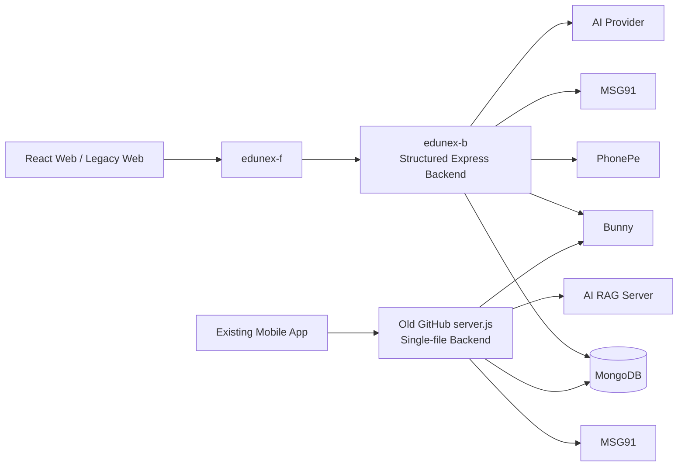
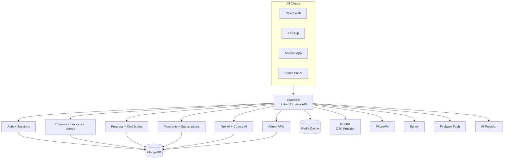
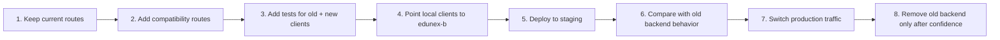
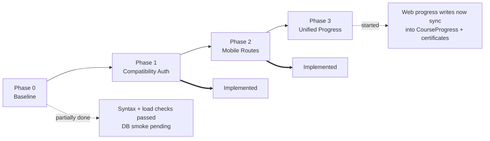
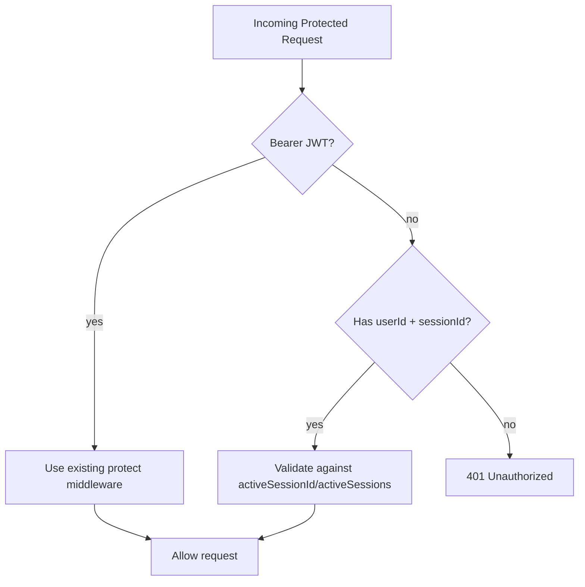
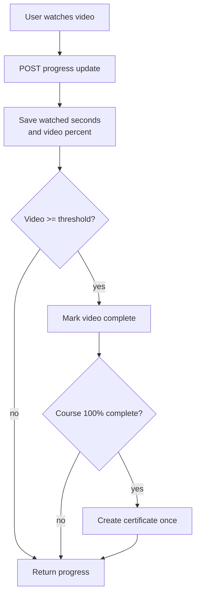
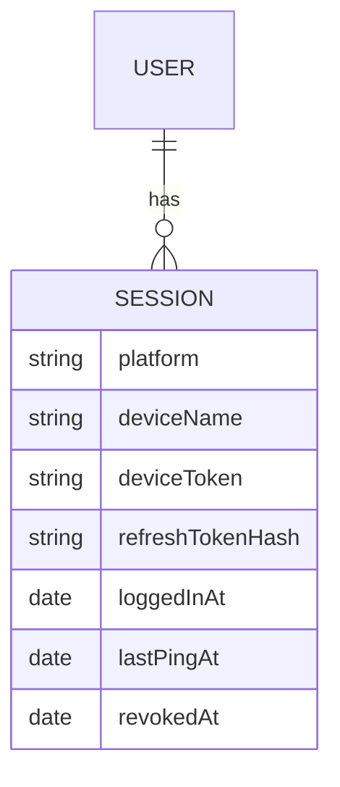
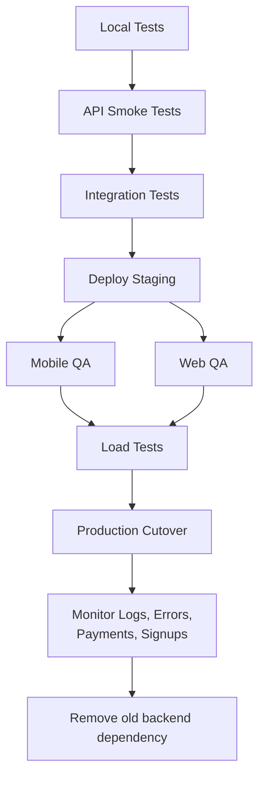

# EduNex Unified Backend Migration Plan

This plan explains how we will turn `edunex-b` into the single backend for web, iOS, Android, admin, payments, videos, and AI without breaking the current backend.

## Short Answer

Yes, this can work.

It should not break the current backend if we follow one rule:

```txt
Add first, verify, then switch traffic.
Do not remove or rewrite working routes until the replacement routes are tested.
```

The migration should be backward-compatible. We will keep existing `edunex-b` APIs working while adding the missing mobile/API behavior from the old GitHub `server.js`.

## Current Situation



Right now we effectively have two backend shapes:

- `edunex-b`: cleaner structured backend and best base for the future.
- Old GitHub `server.js`: single-file backend with some mobile routes/features that are missing from `edunex-b`.

## Target Architecture



Goal:

```txt
One backend codebase: edunex-b
One API owner: edunex-b
All clients call the same backend
Old mobile route compatibility stays until apps are migrated
```

## Non-Breaking Migration Strategy



Rules:

- Do not delete current `edunex-b` routes during migration.
- Add old mobile routes as aliases or compatibility routes.
- Keep current web routes working exactly as they are.
- Keep response shapes stable for the frontend.
- Add tests before cutting traffic over.
- Use environment flags for risky behavior.
- Roll back by pointing traffic back to the old backend or previous deploy.

## Implementation Status

Updated: September 1, 2026



| Phase | Status | What changed |
| --- | --- | --- |
| Phase 0 | Mostly implemented | Dependencies installed, `.env.example` added, route contracts documented, smoke runner added, syntax checks passed, no-DB local smoke passed. Real DB smoke is pending because this workspace has no connected MongoDB. |
| Phase 1 | Implemented | Added compatibility auth that accepts current Bearer JWTs and old mobile `userId + sessionId` auth only on compatibility routes. |
| Phase 2 | Implemented | Added old mobile route coverage for auth validation, subscription, wishlist, progress, certificates, course videos, top courses, most-watched video, Bunny thumbnail/download, course AI proxy, and admin course progress. |
| Phase 3 | Started | Existing web `POST /api/progress` keeps its response shape but also syncs into `CourseProgress` and certificate logic. |
| Phase 4 | Started | Session records now include `sessionId`, device/platform metadata, refresh token hash, and logout state. Login/signup persist sessions, refresh is session-bound, ping updates the current session, logout revokes the current session, and logout-all revokes every session. |
| Phase 5 | Started | Protected public user routes and Bunny video listing, added admin login rate limit, added production safety exits for dev OTP/rate-limit disable, and hardened image proxy against private/internal hosts. |

## Phase 0: Baseline And Safety

Purpose: freeze what currently works before adding anything.

Tasks:

- Install backend dependencies. Done.
- Add `.env.example`. Done.
- Add a basic smoke test script. Done.
- Confirm `edunex-b` starts locally. Done in no-DB smoke mode.
- Confirm MongoDB connection. Pending real `MONGODB_URI`.
- Confirm current web APIs still respond. Pending real `MONGODB_URI`.
- Document current route contracts. Done in `API_ROUTE_CONTRACTS.md`.

Checks:

```txt
GET /api/health
GET /api/health/db
GET /api/courses
POST /api/auth/login
GET /api/payment/subscription-status
GET /api/wishlist
```

Done when:

- Backend starts locally.
- Current web routes work.
- No existing route has changed behavior.

Current verification commands:

```sh
npm run smoke:api:local
```

Use this for route-load health without requiring MongoDB.

```sh
SMOKE_API_BASE_URL=http://127.0.0.1:3000 npm run smoke:api
```

Use this against a running backend with a real MongoDB connection.

Latest local result:

- `npm run smoke:api:local` passed.
- `npm run smoke:api -- --start` correctly failed DB checks because no local MongoDB is connected in this workspace.

## Phase 1: Compatibility Auth Layer

Purpose: allow both modern JWT clients and old mobile clients to authenticate safely.

Current `edunex-b` style:

```txt
Authorization: Bearer <JWT>
```

Old GitHub backend style:

```txt
userId + sessionId in query/body
```

Plan:

- Keep JWT auth as the main path.
- Add a compatibility helper that can read:
  - Bearer JWT
  - `userId + sessionId` from query/body
- Use this helper only for migrated legacy mobile routes.
- Do not weaken existing protected routes.

Visual:



Done when:

- Current JWT routes still work.
- Old-style mobile auth can be used only on compatibility routes.

Current implementation:

- Added `middleware/compatAuth.js`.
- Existing JWT routes still use the normal auth middleware.
- Compatibility routes can accept either `Authorization: Bearer <JWT>` or old mobile `userId + sessionId`.
- Login/signup now also maintain a small `activeSessions` array for old mobile session compatibility while preserving `activeSessionId`.

## Phase 2: Migrate Missing Mobile Routes

Purpose: bring old mobile app route coverage into `edunex-b`.

Route migration table:

| Old GitHub Route | Current `edunex-b` Status | Plan |
| --- | --- | --- |
| `GET /api/auth/validate/:id` | Missing | Add compatibility route using `userId + sessionId`, return fresh user profile. |
| `GET /api/user/:id/subscription` | Different equivalent exists | Add compatibility alias backed by subscription service. |
| `POST /api/user/wishlist/toggle` | Equivalent exists at `/api/wishlist/toggle` | Add compatibility alias or update mobile to new route. |
| `GET /api/user/:id/progress` | Different equivalent exists at `/api/progress` | Add compatibility route for mobile response shape. |
| `POST /api/user/progress/complete-video` | Missing | Add route/service for video completion. |
| `POST /api/user/progress/update-video` | Missing | Add route/service for partial video progress. |
| `GET /api/user/:id/certificates` | Missing | Add certificates route and model/service if needed. |
| `GET /api/admin/course-progress` | Missing | Add admin-protected course progress view. |
| `POST /api/course-ai/chat` | Missing | Add compatibility route or map to `/api/ai/chat`. |
| `GET /api/courses/top` | Missing | Add public top-courses endpoint. |
| `GET /api/videos/most-watched` | Missing | Add protected most-watched video endpoint. |
| `GET /api/courses/:id/videos` | Similar protected lessons route exists | Add mobile-compatible response route. |
| `PATCH /api/courses/:courseId/videos/:videoId` | Missing | Add admin-protected route only. |
| `PATCH /api/user/:id/avatar` | Equivalent exists via `PATCH /api/auth/me` | Add compatibility route or update mobile. |
| `GET /api/bunny/thumbnail/:guid` | Missing | Add safe Bunny thumbnail route. |
| `GET /api/videos/:guid/download` | Missing | Add protected video download route. |

Done when:

- Old mobile app can call required routes.
- Web APIs continue working.
- Routes are covered by smoke/integration tests.

Current implementation:

- Added `routes/mobileCompat.js`.
- Added `services/mobileCompatibilityService.js`.
- Added `models/Certificate.js` using the old `certificates` collection.
- Mounted compatibility routes after existing `/api` modules in `server.js`, so current routes keep priority.
- Syntax and module-load smoke checks passed. DB-backed endpoint checks are still pending against a real MongoDB environment.

## Phase 3: Unify Progress And Certificates

Purpose: make progress tracking consistent across web and mobile.

Target flow:



Implementation:

- Create a shared progress service.
- Use the same progress logic for:
  - web
  - iOS
  - Android
- Create certificate only once per user/course.
- Track analytics events for:
  - video start
  - video progress
  - video complete
  - course complete
  - video download

Done when:

- Web and mobile progress write to the same data shape.
- Course completion can issue certificates.
- No duplicate certificates are created.

Current implementation:

- Mobile compatibility routes write directly to `CourseProgress`.
- Existing web `POST /api/progress` still returns the existing `Progress` response, but now also mirrors updates into `CourseProgress`.
- Web completion can now trigger the same certificate creation path as mobile completion.
- Video ids are normalized so clients can send course-video `_id`, Bunny id, Youtube id, or legacy video id without splitting progress records.

Still needed:

- Add integration tests with a real MongoDB test database.
- Decide later whether web `GET /api/progress` should keep returning `Progress`, return unified `CourseProgress`, or expose both during transition.

## Phase 4: Upgrade Sessions For True Multi-Device Support

Purpose: make web, iOS, and Android work together without logging each other out unexpectedly.

Current model:

```txt
User
  activeSessionId
  deviceToken
```

Target model:

```txt
User
  profile fields
  subscription summary

Session
  user
  platform
  deviceName
  deviceToken
  refreshTokenHash
  loggedInAt
  lastPingAt
  revokedAt
```

Visual:



Migration approach:

- Add new fields/model first.
- Keep `User.activeSessionId` during transition.
- New logins create `Session` records.
- Existing JWT behavior keeps working.
- Later, refresh tokens become per-session.
- Only after all clients migrate, remove old single-session assumptions.

Done when:

- Web can stay logged in while mobile is logged in.
- iOS and Android can have separate sessions.
- Logout one device does not force logout all devices.
- Logout all devices is still possible.

Current implementation:

- `Session` records now include `sessionId`, `platform`, `deviceName`, `deviceToken`, `refreshTokenHash`, `ipAddress`, `userAgent`, `loggedInAt`, `lastPingAt`, and `loggedOutAt`.
- Login/signup create a `Session` record and still maintain legacy `User.activeSessionId` plus `User.activeSessions`.
- Refresh tokens are now tied to a session id.
- `PATCH /api/sessions/ping` updates the current session id.
- `POST /api/auth/logout` revokes the current session id instead of clearing all devices.
- `POST /api/auth/logout-all` revokes every session for the current user.
- `GET /api/auth/sessions` lists active sessions without exposing raw session ids.

Still needed:

- Add authenticated integration tests with real test users on web, iOS, and Android flows.
- Decide final max-session policy after mobile app behavior is confirmed.

## Phase 5: Harden Security

Purpose: make unified backend safe enough for production traffic.

Priority fixes:

| Risk | Fix |
| --- | --- |
| Public `/api/users` routes | Remove or protect with admin auth. |
| Weak admin login | Add rate limiting, hashed admin users, later MFA. |
| In-memory auth rate limits | Move rate limits to Redis. |
| OTP dev behavior | Fail production if dev OTP/auto OTP is enabled. |
| Image/video proxy SSRF | Allowlist hosts and block private/internal IPs. |
| Browser token storage | Move refresh token to secure HttpOnly cookie later. |
| Missing validation layer | Add shared Zod/Joi request validation. |
| Verbose errors | Add centralized production-safe error handler. |

Done when:

- Public data exposure is closed.
- Admin login cannot be brute-forced easily.
- OTP behavior is production-safe.
- Proxy routes cannot fetch internal network URLs.

Current implementation:

- `GET /api/users` and `POST /api/users` are admin-protected.
- `GET /api/bunny/videos` is admin-protected.
- Admin login has an in-memory rate limit and safer password comparison.
- Production exits instead of starting with `AUTO_VERIFY_OTP=true`.
- Production exits instead of starting with `DISABLE_AUTH_RATE_LIMIT=true`.
- `/api/image-proxy` blocks localhost/private/internal IP ranges and hostnames. It also supports `IMAGE_PROXY_ALLOWED_HOSTS`.

Latest safety checks:

- `npm run smoke:api:local` passed.
- Anonymous `GET /api/bunny/videos` returned `401`.
- Wrong admin login returned `401`.
- Private image proxy target returned `400/403`.
- Production startup guard rejected `AUTO_VERIFY_OTP=true`.
- Production startup guard rejected `DISABLE_AUTH_RATE_LIMIT=true`.

Still needed:

- Move auth/admin rate limits to Redis for multi-instance deployments.
- Add shared request validation with Zod/Joi or a similar validation layer.
- Rotate any secrets that were ever committed, shared, or exposed in frontend environments.

## Phase 6: Connect Frontend And Apps

Purpose: point all clients to `edunex-b`.

React web should use:

```js
fetch("/api/auth/login")
fetch("/api/courses")
fetch("/api/payment/subscription-status")
fetch("/api/wishlist")
fetch("/api/ai/chat")
```

Local web flow:

```txt
edunex-f Vite
http://localhost:5173
        |
        | /api proxy
        v
edunex-b API
http://localhost:3000
```

Mobile flow:

```txt
iOS / Android app
        |
        | HTTPS API calls
        v
edunex-b deployed API
```

Done when:

- Web no longer depends on the old backend URL.
- Mobile can point to `edunex-b`.
- Admin works against `edunex-b`.

## Phase 7: Test, Stage, Cut Over

Purpose: switch safely.



Minimum test list:

- Health check
- DB check
- Signup OTP path
- Login
- Refresh
- Profile
- Course list
- Protected course videos
- Progress update
- Certificate creation
- Wishlist toggle
- Payment status
- PhonePe webhook verification
- AI chat
- Admin login
- Admin course CRUD

Done when:

- Staging matches old behavior where needed.
- React web works.
- iOS works.
- Android works.
- Logs show no major API errors.
- Production traffic is switched.

## What Will Not Break Current Backend

This migration is safe if we keep the work additive at first.

Safe changes:

- Adding new route files.
- Adding compatibility aliases.
- Adding shared service functions.
- Adding tests.
- Adding `.env.example`.
- Adding new session records while keeping old fields.
- Adding stricter production-only checks behind environment logic.

Risky changes to delay:

- Deleting existing routes.
- Changing existing response shapes.
- Replacing auth middleware everywhere at once.
- Removing `activeSessionId` immediately.
- Changing payment callback behavior before tests.
- Changing frontend API paths before backend compatibility exists.

## Final Route Shape

Long-term clean routes:

```txt
/api/auth/*
/api/users/me/*
/api/sessions/*
/api/courses/*
/api/videos/*
/api/progress/*
/api/certificates/*
/api/wishlist/*
/api/payment/*
/api/ai/*
/api/admin/*
```

Temporary compatibility routes:

```txt
/api/auth/validate/:id
/api/user/:id/subscription
/api/user/:id/progress
/api/user/progress/complete-video
/api/user/progress/update-video
/api/user/:id/certificates
/api/course-ai/chat
```

Once all clients use the clean routes, compatibility routes can be deprecated.

## Exact Execution Order

1. Add `.env.example` and local setup notes.
2. Add smoke test script for existing `edunex-b` routes.
3. Add compatibility auth helper.
4. Add mobile compatibility routes without removing current routes.
5. Add certificates model/service/routes.
6. Add shared progress service.
7. Add course video/top/most-watched/download routes.
8. Add course AI compatibility route.
9. Add multi-device session model while keeping old fields.
10. Add Redis-backed rate limiting.
11. Protect/remove risky public routes.
12. Harden image/video proxy routes.
13. Add integration tests.
14. Point `edunex-f` local proxy to `edunex-b`.
15. Deploy staging.
16. QA web, iOS, Android, admin, payments.
17. Switch production traffic.
18. Monitor and clean up old backend dependency.

## Final Verdict

`edunex-b` can become the real unified backend.

The safe path is not a rewrite. It is a controlled migration:

```txt
Keep what works.
Add what is missing.
Test both web and mobile contracts.
Then switch traffic.
```
