# Skillomate architecture

Updated: 11 September 2026. Scope: the source code in this repository, including the web app, mobile app, primary API, older API, AI services, storage, payments, and operational dependencies.

This describes implemented behavior, not proof that every integration is running in production. Configuration presence does not establish provider activation, deployment health, or a successful live transaction. Credential values are intentionally excluded.

## Contents

1. [System map](#1-system-map)
2. [Repository map](#2-repository-map)
3. [Web frontend](#3-web-frontend)
4. [Mobile frontend](#4-mobile-frontend)
5. [Backend request processing](#5-backend-request-processing)
6. [API inventory](#6-api-inventory)
7. [Authentication and OTP](#7-authentication-and-otp)
8. [Subscriptions and payments](#8-subscriptions-and-payments)
9. [Courses, media, progress, and certificates](#9-courses-media-progress-and-certificates)
10. [NEX AI](#10-nex-ai)
11. [Database architecture](#11-database-architecture)
12. [Deletion and data lifecycle](#12-deletion-and-data-lifecycle)
13. [Caching, jobs, and notifications](#13-caching-jobs-and-notifications)
14. [Configuration and deployment](#14-configuration-and-deployment)
15. [Testing and troubleshooting](#15-testing-and-troubleshooting)
16. [Known gaps and upgrade priorities](#16-known-gaps-and-upgrade-priorities)

## 1. System map

The primary web stack is **React/Vite → Express → MongoDB**. Expo mobile can call the primary Express API through compatibility routes. The repository also contains an older mobile backend and a separate AI/RAG server. Those are separate implementations; updating one does not update the others.

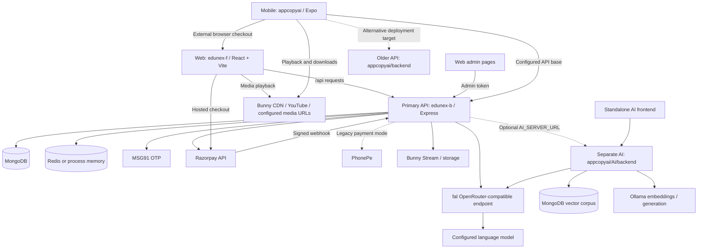

Solid lines describe implemented connections; dotted lines identify alternative or optional paths. A line is not a claim that its credentials, external service, or deployment is currently working.

## 2. Repository map

| Path | Responsibility | Relationship to the main application |
| --- | --- | --- |
| [edunex-f](edunex-f) | React web application, admin UI, Vite build, shared browser API runtime | Main browser frontend |
| [edunex-b/server.js](edunex-b/server.js) | Express bootstrap, inline catalogue/admin APIs, static hosting | Main API entry point |
| [edunex-b/routes](edunex-b/routes) | Authentication, payments, AI, content, sessions, mobile compatibility | Mounted by main API |
| [edunex-b/controllers](edunex-b/controllers) | Payment orchestration | Provider verification and entitlement updates |
| [edunex-b/services](edunex-b/services) | Provider HTTP clients, knowledge retrieval, cache, deletion, compatibility | Reusable backend behavior |
| [edunex-b/models](edunex-b/models) | Mongoose schemas | Application persistence |
| [edunex-b/jobs](edunex-b/jobs) | Subscription expiry and course analytics cron jobs | Run inside API process |
| [edunex-b/knowledge](edunex-b/knowledge) | Curated teaching material | Main tutor retrieval corpus |
| [appcopyai/App.js](appcopyai/App.js) | Expo screens, session state, playback, downloads, AI, profile | Mobile frontend; much behavior is in one file |
| [appcopyai/backend](appcopyai/backend) | Older Express implementation | Divergent backend, not a wrapper around edunex-b |
| [appcopyai/Ai/backend](appcopyai/Ai/backend) | Separate AI/RAG HTTP service | Optional course-chat upstream and standalone AI API |
| [appcopyai/Ai/frontend](appcopyai/Ai/frontend) | Standalone Vite AI interface | Separate from the main web tutor |
| [appcopyai/Ai/scripts](appcopyai/Ai/scripts) | PDF extraction, transcription, ingestion | Builds publisher-content knowledge corpus |

The [mobile Dockerfile](appcopyai/Dockerfile) copies `appcopyai/backend`. It does **not** deploy `edunex-b`. Deployment selection is therefore a material architecture decision.

## 3. Web frontend

### Rendering and navigation

[main.jsx](edunex-f/src/main.jsx) mounts [App.jsx](edunex-f/src/App.jsx). App selects lazy-loaded page components using [routes.js](edunex-f/src/lib/routes.js), a custom route mapping rather than React Router. Shared navigation/footer surround normal pages; admin has a separate shell.

| Routes | Purpose |
| --- | --- |
| `/`, `/home-based`, `/about` | Landing and marketing |
| `/login`, `/signup`, `/otp` | Authentication and verification |
| `/courses`, `/course`, `/lesson`, `/videos` | Catalogue and learning |
| `/dashboard`, `/wishlist`, `/certificates` | Learner activity |
| `/ai-tutor` | Dedicated NEX chat |
| `/payment` | Subscription checkout and status |
| `/profile`, `/edit-profile` | Account settings and deletion |
| `/help`, `/terms`, `/privacy` | Support and policy pages |
| `/admin/login`, `/admin/dashboard`, `/admin/users`, `/admin/courses`, `/admin/upload` | Administrative UI |

Route helpers support clean URLs and historical HTML aliases, preserving query strings and hashes where applicable.

### React and legacy runtime coexist

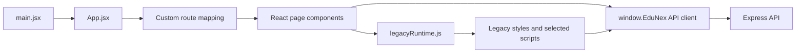

[legacyRuntime.js](edunex-f/src/legacyRuntime.js) loads selected scripts/styles, avoids duplicate asset loading, and supports legacy page setup/cleanup. Generated page metadata derives from legacy HTML. This is a migrated hybrid UI, not a fully isolated React-only component system.

The dedicated `AiTutorPage` excludes old `js/main.js` tutor behavior. That older script contains canned replies and a separate chat-storage API; its existence does not mean the current tutor uses it.

### Shared API and browser state

[js/edunex-api.js](edunex-f/js/edunex-api.js) exposes `window.EduNex`, handles requests, saves authentication, refreshes tokens, and provides shared normalization helpers. Authentication uses browser storage and bearer headers, not HttpOnly session cookies. Admin uses its own client/token state in [adminApi.js](edunex-f/src/pages/admin/adminApi.js).

Browser state includes access/refresh tokens, user snapshots, theme, course progress/cache, player settings, and assistant preferences. Dedicated chat history is component memory; floating-widget history is runtime memory. Reloading does not restore these conversations from a server history API.

[authNavigation.js](edunex-f/src/lib/authNavigation.js) transfers normalized mobile numbers between login/signup through short-lived session storage. It also handles safe continuation paths. [razorpayCheckout.js](edunex-f/src/lib/razorpayCheckout.js) loads Razorpay's hosted checkout script and manages checkout callbacks.

### Build and serving

`npm run build` generates legacy page metadata, runs Vite, then copies static assets. Edit source pages/styles, not generated output. [vite.config.js](edunex-f/vite.config.js) proxies `/api` to `VITE_API_PROXY_TARGET`, defaulting to `http://127.0.0.1:3000` in local development.

A production SPA rewrite only solves frontend routes. A separately hosted frontend still needs an API reverse proxy or correctly configured API origin; its development Vite proxy is not deployed automatically.

## 4. Mobile frontend

[App.js](appcopyai/App.js) combines screen navigation/state, authentication, catalogue, player, progress, AI, profile, downloads, and certificate handling. It calls the server selected by `EXPO_PUBLIC_API_BASE`; web links use `EXPO_PUBLIC_WEB_APP_BASE`, while the subscription link also has a hardcoded hosted URL.

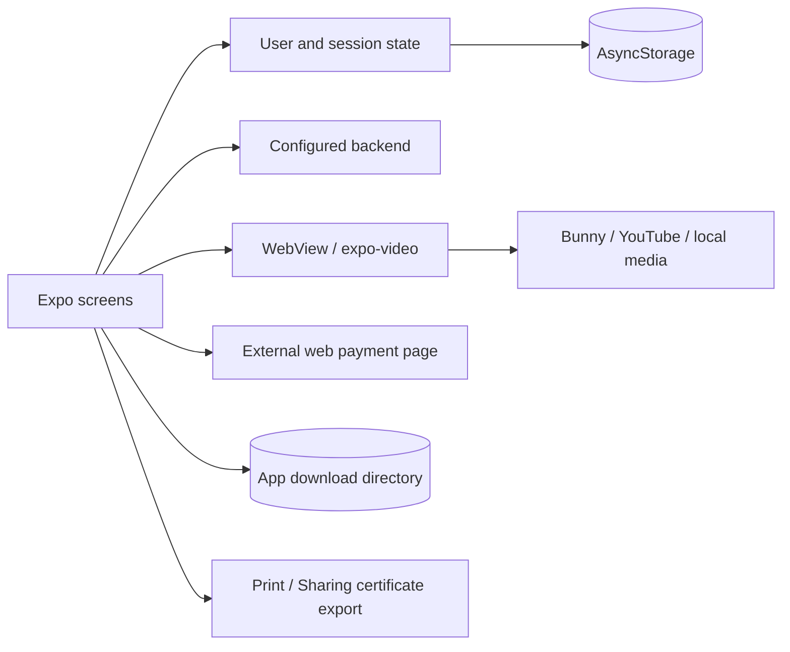

- Authentication state is saved in AsyncStorage; it is not currently protected with a SecureStore-based token implementation.
- Legacy calls can pass `userId` and `sessionId` in query strings/body; newer calls can carry bearer tokens.
- WebView and native video cover different media sources. Downloaded files are stored under the app's documents directory, with metadata in AsyncStorage.
- Certificates can be rendered/exported with Print and Sharing. Exported files can outlive app-side records.
- Screen-capture prevention is used in parts of playback, but this does not constitute DRM or enforce offline entitlement expiration.
- The app attempts a WebSocket connection; a matching WebSocket server is not present in the inspected primary backend.
- Mobile main-chat requests use `appcopyai/services/aiClient.js`, sending up to 12 prior turns, excluding failed assistant responses, and enforcing a 30-second request timeout.

Do not assume mobile and web have identical pricing, access checks, or behavior merely because they use the same database. See the gaps section.

## 5. Backend request processing

[server.js](edunex-b/server.js) loads environment configuration, configures Express/Helmet/CORS/parsers, connects Mongoose, mounts API routers, registers inline routes, and optionally serves frontend files. Background jobs are loaded after database connection unless disabled.

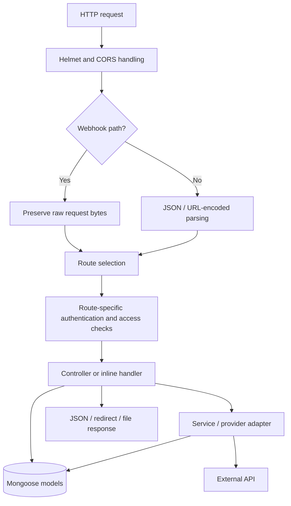

Raw webhook parsing runs before general JSON parsing because payment signatures authenticate the original bytes. Authentication is route-specific: public catalogue routes, learner routes, admin routes, and provider webhooks have different trust mechanisms.

Important boundaries:

| Boundary | Implementation |
| --- | --- |
| Standard learner bearer authentication | [middleware/auth.js](edunex-b/middleware/auth.js) |
| Mobile-compatible authentication | [middleware/compatAuth.js](edunex-b/middleware/compatAuth.js) |
| Administrator authentication | [middleware/adminAuth.js](edunex-b/middleware/adminAuth.js) |
| Subscription access | [middleware/checkSubscription.js](edunex-b/middleware/checkSubscription.js), plus compatibility service checks |
| Provider verification | Payment controllers/services |
| Persistence | Mongoose models; separate AI service also accesses its corpus database |

## 6. API inventory

Paths below include their mount prefix. Aliases exist for older clients; this table groups them by capability rather than repeating each spelling.

| Area | Routes | Main owner / behavior |
| --- | --- | --- |
| Health | `GET /api/health`, `/api/health/db` | Server/process and database diagnostics |
| Signup | `POST /api/auth/signup`, `/register` | Verified signup token, password hashing, account/session creation |
| OTP | `POST /api/auth/send-mobile-otp`, `/resend-mobile-otp`, `/verify-mobile-otp` | [auth.js](edunex-b/routes/auth.js); older send/verify aliases also supported |
| Login/reset | `POST /api/auth/login`, `/password-reset/request`, `/password-reset/confirm` | Password authentication and OTP-backed recovery |
| Account | `GET/PATCH /api/auth/me`, `DELETE /api/auth/account` | Profile and self-service deletion |
| Sessions | `POST /api/auth/refresh`, `/logout`, `/logout-all`; `GET /api/auth/sessions`; `PATCH /api/sessions/ping` | Token rotation, revocation, activity |
| Payment | `GET /api/payment/config`; `POST /api/payment/initiate-trial`, `/razorpay/verify`, `/cancel-subscription`; `GET /api/payment/subscription-status`; `GET/POST /api/payment/verify-app-access` | [payment.js](edunex-b/routes/payment.js) |
| Provider callbacks | `POST /api/webhooks/razorpay`, `/api/webhooks/phonepe`; `GET /api/payment/callback` | Signature/callback handling, reconciliation |
| Development payment | `GET /api/payment/simulate`; `POST /api/payment/simulate/complete` | Development simulator, not real payment confirmation |
| Catalogue | `GET /api/categories`, `/api/courses`, `/api/recommendations/courses`, `/api/courses/checkout-summary` | Inline server routes, cached summaries |
| Learning | `GET /api/courses/:id/lessons`, `/api/lessons/:id`; `GET/POST /api/progress` | [content.js](edunex-b/routes/content.js), subscription-gated |
| Wishlist | `GET/POST/DELETE /api/wishlist`; `POST /api/wishlist/toggle` | Learner saved courses |
| Main AI | `GET /api/ai/health`, `/api/ai/courses`; `POST /api/ai/chat` | [ai.js](edunex-b/routes/ai.js), compatible authentication |
| Legacy chat storage | `GET/POST /api/ai-tutor` | Subscription-gated `AiTutorSession` persistence |
| Support | `POST /api/contact-enquiries` | Optional user association; required contact/message fields |
| Mobile account | `GET /api/auth/validate/:id`, `/api/user/:id/subscription`; `PATCH /api/user/:id/avatar` | [mobileCompat.js](edunex-b/routes/mobileCompat.js) |
| Mobile learning | `GET /api/user/:id/progress`, `/api/user/:id/certificates`; `POST /api/user/progress/complete-video`, `/api/user/progress/update-video`, `/api/user/wishlist/toggle` | Compatible user ownership and learning serialization |
| Mobile content | `GET /api/courses/top`, `/api/videos/most-watched`, `/api/courses/:id/videos`, `/api/videos/:guid/download` | Catalogue, gated media, download metadata |
| Course AI | `POST /api/course-ai/chat` | Authenticated forwarding to optional AI server |
| Media utilities | `GET /api/image-proxy`, `/api/bunny/thumbnail/:guid`, `/api/bunny/videos` | Image/thumbnail proxying; Bunny video listing is admin-gated |
| Admin | `POST /api/admin/login`; `GET /api/admin/analytics`, `/users`, `/user-management`, `/courses`, `/course-progress` | Admin authentication and reporting |
| Admin mutation | `DELETE /api/admin/users/:id`; `PATCH/DELETE /api/admin/courses/:id`; `POST /api/categories`, `/api/courses`; `GET/POST /api/users`; `PATCH /api/courses/:courseId/videos/:videoId` | Admin-gated management operations |

For exact validation, response shapes, aliases, and access requirements, follow the linked route files. Similar endpoint names in the older backend do not guarantee equivalent behavior.

## 7. Authentication and OTP

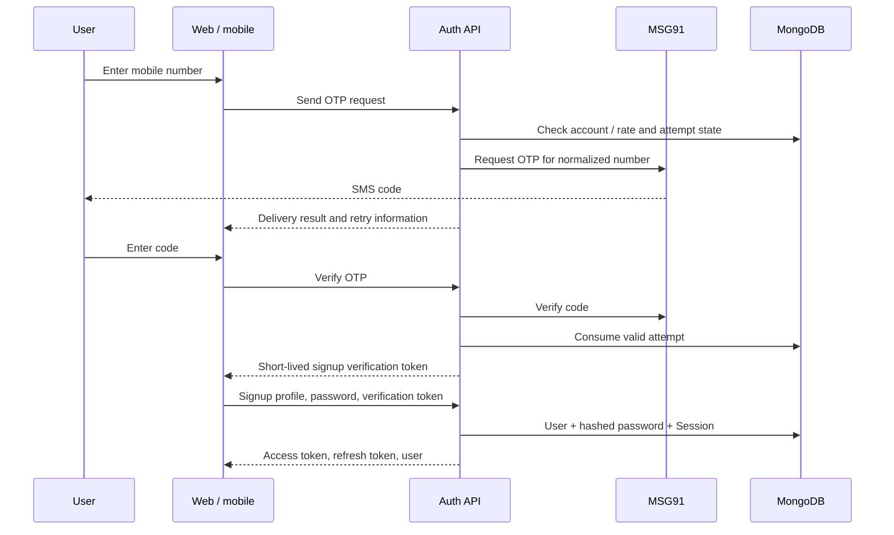

[otpService.js](edunex-b/services/otpService.js) selects MSG91 using `OTP_PROVIDER` or `OTP_DELIVERY_PROVIDER`. MSG91 send/verify/retry calls use its HTTP API. Persistent attempts impose expiry, resend cooldown, and attempt limits. The provider template determines delivered code length; verification accepts 4–6 digit real-provider codes. Development OTP behavior is separate.

Signup with an existing mobile returns `MOBILE_ALREADY_REGISTERED`; the web redirects to login with the number filled. Login for an absent mobile returns `MOBILE_NOT_REGISTERED`; the web redirects to signup with the number filled. Incorrect passwords do not trigger the absent-account path.

Passwords use bcrypt. Access JWTs are short-lived (15 minutes), refresh JWTs last seven days, and signup verification tokens last ten minutes. Session records hold a refresh-token hash; refresh rotates credentials. Logout marks sessions revoked; logout-all revokes all known sessions. Session pings update activity metadata.

The compatibility path can authenticate older clients using a user/session pair. This increases the importance of protecting those identifiers and consistently enforcing expiry. Current fallback behavior means the intended active-session cap is not a strict global guarantee.

## 8. Subscriptions and payments

### Current checkout

The current web purchase UI offers the ₹1 trial that sets up recurring billing. The configured defaults are ₹1 now, a 24-hour trial, then ₹500/month, with 120 configured billing cycles. These are configurable application values, not a statement of final legal terms. The backend retains a monthly checkout capability even though the web no longer exposes a second plan option.

[razorpayController.js](edunex-b/controllers/razorpayController.js) orchestrates billing; [razorpayService.js](edunex-b/services/razorpayService.js) calls Razorpay over authenticated HTTP. The backend owns the secret key. The browser receives the checkout key ID, subscription ID, and customer prefill only.

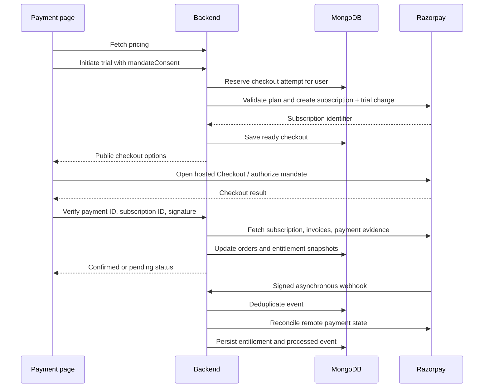

### Checkout state versus access state

`RazorpayBilling` is an attempt/recovery record, not the sole access decision. Its phases include `creating`, `ready`, `uncertain`, and `closed`. Atomic reservation prevents simultaneous checkout creation for the same user. If remote creation becomes ambiguous, `uncertain` avoids blindly creating another mandate. Provider notes carry an attempt identifier for recovery.

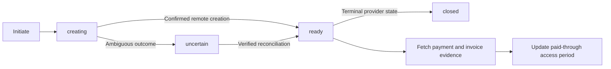

A successful browser callback alone does not grant access. The server verifies the checkout signature and ownership, then reconciles captured INR payments, invoice periods, amounts, and refunds. Mandate authorization alone is not equivalent to a paid subscription. Full refunds can remove the corresponding payment's entitlement; partial refunds are treated differently.

Webhook authentication uses raw-body HMAC. `BillingWebhook` tracks processed events for replay handling; failed processing remains retryable. Orders retain both modern Razorpay fields and a historically named PhonePe transaction field used for unique identifiers.

Cancellation is implemented server-side through `/api/payment/cancel-subscription`, followed by reconciliation. The payment-page cancellation button is currently removed. Paid-through access and cancellation of future charges are distinct concepts.

### Legacy and operational constraints

`PAYMENT_GATEWAY_MODE` selects Razorpay versus the retained PhonePe/simulator paths. `RAZORPAY_ENABLED` being present is not itself the selector. PhonePe code remains in [phonePeService.js](edunex-b/services/phonePeService.js) and the legacy payment controller.

The supplied local configuration has an empty `RAZORPAY_PLAN_ID`: real subscription creation needs a configured matching plan. A local webhook requires a public HTTPS tunnel forwarding to `POST /api/webhooks/razorpay`; provider servers cannot reach your computer's `localhost`. Temporary tunnel URLs are not production endpoints.

There is no implemented automatic refund-issuance workflow in the main API. Razorpay entitlement reconciliation is driven by status checks and webhooks, rather than a dedicated periodic reconciliation worker. See [PAYMENTS_AND_OTP.md](edunex-b/docs/PAYMENTS_AND_OTP.md) for setup details.

## 9. Courses, media, progress, and certificates

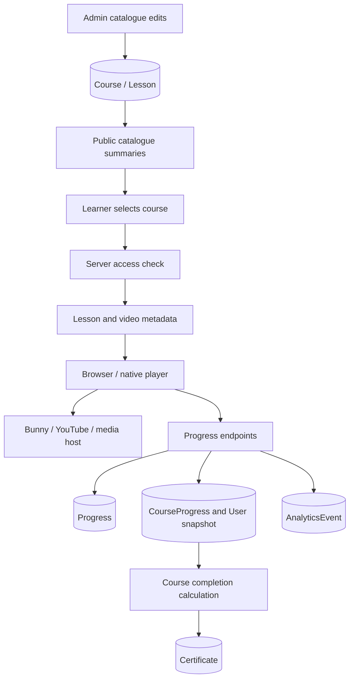

Courses hold publisher metadata and video/source information; lessons provide learning references. The primary backend gates detailed learning/progress routes. Mobile compatibility routes serialize course/video information and synchronize legacy progress representations through [mobileCompatibilityService.js](edunex-b/services/mobileCompatibilityService.js).

Progress is duplicated across `Progress`, `CourseProgress`, and portions of `User`. This supports older clients but creates consistency work. Mobile and web now send playback heartbeats through the shared certification service. Authoritative LearningProgress records track merged intervals, resume position, session and criteria version. Compatibility snapshots are derived from these records. Timing checks reject obvious seeks and long gaps, but client telemetry still cannot prove attention or constitute proctored assessment.

Bunny integration supplies video metadata, thumbnails, and media locations; actual playback generally goes to media hosts rather than streaming every byte through Express. Image and thumbnail proxy endpoints are separate backend paths. Mobile downloads keep files locally; continued offline availability is not currently tied to robust expiring licenses.

Wishlist state also exists in more than one representation (`Wishlist` and user compatibility fields). Keep both paths in mind when changing data cleanup or synchronization.

## 10. NEX AI

### Main web/mobile API

The primary tutor route wiring lives in [routes/ai.js](edunex-b/routes/ai.js), with provider/context logic in [aiTutorService.js](edunex-b/services/aiTutorService.js) and grounding logic in [tutorKnowledge.js](edunex-b/services/tutorKnowledge.js).

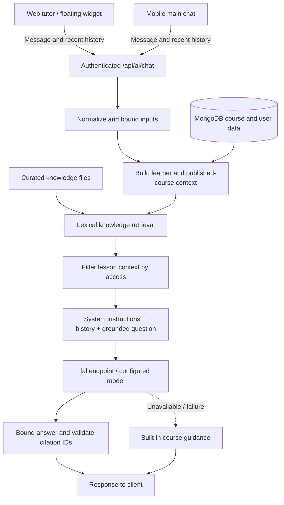

The request supports bounded message text, recent history, course context, assistant name, and page path. The main history window is up to 12 messages. Context includes published courses, a learner display name, and relevant allowed material. The code uses lexical retrieval over curated files; it does not train model weights or require a vector database for this path.

Provider calls use the fal OpenRouter-compatible endpoint with a configured model; the configured default is `google/gemini-2.5-flash`. The response is bounded and citation IDs are checked against supplied evidence. Missing credentials or upstream failures can produce fallback guidance; seeing a reply is therefore not sufficient evidence of a successful model call.

Main-chat history is supplied by clients and is not automatically persisted in `AiTutorSession`. That model belongs to the separate legacy `/api/ai-tutor` API. The floating widget sends page context; the main API strips query strings and fragments before forwarding it to the model. Email/mobile values are not used as display-name fallbacks. No universal prompt PII-redaction or dedicated moderation layer is implemented.

### Separate RAG service

[appcopyai/Ai/backend/server.js](appcopyai/Ai/backend/server.js) exposes health/course/chat endpoints, including `/api/chat`, `/api/ai/chat`, and `/api/course-chat`. It uses MongoDB vector search over `rag_chunks`, Ollama embeddings, and fal or Ollama generation depending on configuration.

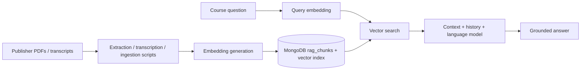

The main backend's `/api/course-ai/chat` forwards to this service only when `AI_SERVER_URL` is configured. The standalone AI frontend can call it directly. Its permissive CORS and lack of equivalent main-API authentication mean it needs an explicit deployment boundary before public exposure. Provider retention/training policy cannot be inferred from source code.

## 11. Database architecture

MongoDB is the primary system of record. Mongoose references are application-managed relationships, not database-enforced cascading foreign keys. Some compatibility records use string user/course IDs rather than ObjectIds.

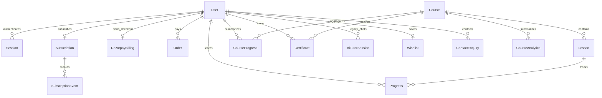

The diagram shows conceptual ownership; consult schemas for actual uniqueness constraints and optional fields.

| Model | Data / purpose |
| --- | --- |
| `User` | Profile, password hash, mobile verification, activity, session references, subscription and learning snapshots |
| `Session` | User/session IDs, refresh hash, platform/device metadata, IP/user agent, activity and logout timestamps |
| `OtpAttempt` | Phone-scoped attempt generation, limits and expiry; TTL cleanup |
| `Course` | Publisher content, video sources, thumbnails, transcripts/notes, status, category, aggregate statistics |
| `Lesson` | Course-linked lesson/video reference |
| `Category` | Catalogue categorization |
| `Progress` | User/course/lesson watch progress and completion |
| `CourseProgress` | Compatibility progress summary, per-video state, learner/course snapshots |
| `Certificate` | Certificate identifier, user/course linkage, name/email and issue date |
| `Wishlist` | User's saved course references |
| `Review` | Rating/review and verification/subscription association; model does not establish a complete exposed UI flow |
| `LessonNote` | User lesson notes; model presence does not establish an active writer in current screens |
| `AiTutorSession` | Legacy persisted chat messages per user/course |
| `ContactEnquiry` | Optional user link, contact fields, message and handling status |
| `Notification` | Notification records; not proof of a complete delivery pipeline |
| `AnalyticsEvent` | Flexible individual learning/download event payloads |
| `CourseAnalytics` | Daily course aggregate measurements |
| `Subscription` | Provider identifiers, mandate/subscription state, trial and paid periods, cancellation/billing fields |
| `Order` | Payment/refund amounts, statuses, provider payment and subscription identifiers |
| `SubscriptionEvent` | Subscription lifecycle/event metadata |
| `RazorpayBilling` | Per-user checkout coordination, remote subscription association, recovery phase |
| `BillingWebhook` | Event deduplication and processed timestamp |
| `Coupon` | Discount configuration, usage and expiry; availability depends on consuming flow |
| `rag_chunks` | Separate AI corpus collection, accessed outside the main model set |

Schema files are in [models](edunex-b/models). Database backup location, encryption settings, production region, and operator access controls are infrastructure facts that this repository does not establish.

## 12. Deletion and data lifecycle

Self-service deletion uses `DELETE /api/auth/account` with authentication, current password, and the typed confirmation. [accountDeletionService.js](edunex-b/services/accountDeletionService.js) checks mandate state before removing linked records.

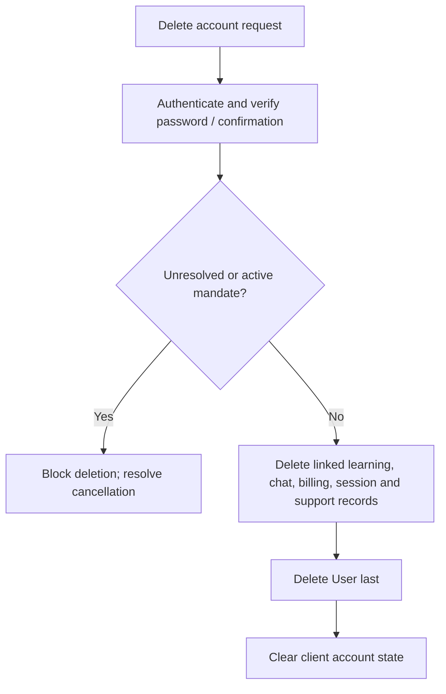

Dependent deletes run in parallel; the user is removed last. This is not an all-or-nothing database transaction: partial cleanup is possible on failure and retry is part of the design. The mobile client also attempts to clear app downloads and saved user state.

Deletion does not automatically purge provider systems, backups, logs, exported certificates, aggregate statistics, or unlinked guest enquiries. `BillingWebhook` records are separate. OTP records expire through their TTL. Most other collections do not have automatic retention TTLs.

Admin deletion now uses the same mandate-aware cleanup service as self-service deletion. Per-collection result counts include Razorpay billing correctly. Both paths retain the partial-cleanup/retry limitation described above.

## 13. Caching, jobs, and notifications

[cacheService.js](edunex-b/services/cacheService.js) uses Redis when configured and available, with per-process memory fallback. Cache namespaces use `CACHE_PREFIX`. Catalogue read caches typically last 60 seconds; checkout summaries use a longer ten-minute cache. Cache entries are disposable, not authoritative payment or account state.

| Job | Schedule | Effect |
| --- | --- | --- |
| Subscription expiry | Every 30 minutes | Expires overdue non-Razorpay subscriptions; does not grant recurring access solely from a mandate |
| Daily course analytics | 01:00 | Writes daily course aggregate data |
| Course statistics refresh | 02:00 | Refreshes course-level aggregate measurements |
| Drop-off calculation | 03:00 | Computes drop-off measurements |

Schedules use the process/runtime timezone unless explicitly configured otherwise. They run in the API process after database connection. `DISABLE_BACKGROUND_JOBS=true` suppresses startup registration. Multiple API replicas would each register jobs unless deployment adds a singleton scheduler/lock.

[pushService.js](edunex-b/services/pushService.js) contains an FCM service-account HTTP delivery adapter. Its existence and token fields in schemas do not establish an end-to-end mobile registration/delivery flow; current mobile notification UI includes preview/static behavior. No separate durable task queue is present for these jobs.

## 14. Configuration and deployment

### Environment responsibility map

This is a map of integration controls, not a credential template. Keep backend secrets on the server; do not put them in `VITE_*` or `EXPO_PUBLIC_*` variables, which are client-visible.

| Area | Principal variables | Consumer |
| --- | --- | --- |
| Runtime/database | `MONGODB_URI`, `PORT`, `NODE_ENV`, `NIXPACKS_NODE_VERSION` | Primary backend/runtime |
| JWT/admin | `JWT_SECRET`, `JWT_REFRESH_SECRET`, `JWT_SIGNUP_SECRET`, `ADMIN_PASSWORD`, `ADMIN_TOKEN_SECRET` | Authentication |
| Origins/static serving | `FRONTEND_ORIGIN`, `FRONTEND_ORIGINS`, `SERVE_FRONTEND` | API/CORS/hosting |
| Web dev proxy | `VITE_API_PROXY_TARGET` | Vite configuration |
| Mobile targets | `EXPO_PUBLIC_API_BASE`, `EXPO_PUBLIC_API_PORT`, `EXPO_PUBLIC_WEB_APP_BASE` | Expo public build configuration |
| OTP selector | `OTP_PROVIDER`, `OTP_DELIVERY_PROVIDER`, `DEFAULT_SMS_COUNTRY_CODE` | OTP service |
| MSG91 | `MSG91_AUTH_KEY`, `MSG91_TEMPLATE_ID`, `MSG91_BASE_URL` | Server-side SMS adapter |
| Development OTP | `DEV_OTP` | Development-only OTP behavior; not a production verification control |
| Razorpay | `PAYMENT_GATEWAY_MODE`, `RAZORPAY_KEY_ID`, `RAZORPAY_KEY_SECRET`, `RAZORPAY_WEBHOOK_SECRET`, `RAZORPAY_PLAN_ID` | Billing selector/provider |
| Pricing | `TRIAL_AMOUNT_PAISE`, `SUBSCRIPTION_AMOUNT_PAISE`, `TRIAL_DURATION_HOURS`, `SUBSCRIPTION_TOTAL_COUNT` | Pricing and checkout payloads |
| Legacy PhonePe | `PHONEPE_CLIENT_ID`, `PHONEPE_CLIENT_SECRET`, `PHONEPE_CLIENT_VERSION`, `PHONEPE_MERCHANT_ID`, `PHONEPE_BASE_URL`, `PHONEPE_REDIRECT_URL`, `PHONEPE_CALLBACK_URL`, legacy salt settings | Retained PhonePe integration |
| Media | `BUNNY_STREAM_LIBRARY_ID`, `BUNNY_STREAM_CDN_HOSTNAME`, `BUNNY_PULL_ZONE_URL`, `BUNNY_STREAM_API_KEY` | Video metadata/media integration |
| Main AI | `FAL_API_KEY` or `FAL_KEY`, `FAL_OPENROUTER_MODEL`, `FAL_OPENROUTER_URL` | Main tutor/provider |
| Course AI upstream | `AI_SERVER_URL` | Mobile course-chat forwarding |
| Separate RAG | `RAG_OLLAMA`, `RAG_CHAT_OLLAMA`, `RAG_MODEL`, `RAG_EMBED`, `RAG_CHAT_PROVIDER`, `OLLAMA_API_KEY`, `MONGO_DB`, `RAG_VECTOR_COLLECTION`, `RAG_VECTOR_INDEX`, `RAG_VECTOR_DIMS` | Standalone AI server |
| Cache/jobs | `REDIS_URL`, `CACHE_PREFIX`, `DISABLE_BACKGROUND_JOBS` | Cache and scheduled jobs |
| Optional FCM | `FCM_SERVICE_ACCOUNT_JSON`, `GOOGLE_APPLICATION_CREDENTIALS`, or component service-account variables | Push adapter |

Aliases and defaults vary by service. A variable appearing in `.env` does not guarantee it is read: in particular, check actual selector logic rather than relying on `RAZORPAY_ENABLED` or `AUTO_VERIFY_OTP` labels.

### Local topology

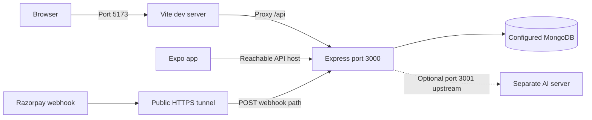

A physical phone needs a reachable LAN/public API host; its `localhost` is the phone. For production, terminate HTTPS, configure permitted frontend origins, route `/api` correctly, and explicitly deploy the intended backend directory. Static hosting, database availability, and provider callbacks are separate dependencies.

### Local commands

Run each service in its own terminal, from the indicated directory:

```sh
# Primary backend
cd edunex-b
npm ci
npm run dev
```

```sh
# Web frontend, from repository root
cd edunex-f
npm ci
npm run dev
```

```sh
# Mobile, from repository root
cd appcopyai
npm install
npm start
```

The separate AI server is optional for main `/api/ai/chat`; start it from `appcopyai/Ai/backend` when testing that service and configure its database/model dependencies. Do not run both backend implementations on the same port.

## 15. Testing and troubleshooting

This documentation change does not perform live OTP sends, payment operations, account deletion, or provider deployment tests.

| Command / check | Purpose | Boundary |
| --- | --- | --- |
| `npm run test:integrations` in edunex-b | Auth-navigation, OTP and Razorpay automated tests | Does not prove a live provider transaction |
| `npm run test:ai` in edunex-b | Chat-history and tutor knowledge tests | Does not prove model-provider availability |
| `npm run eval:ai` in edunex-b | Tutor evaluation script | Inspect configuration first; may invoke a provider |
| `npm run integrations:check` in edunex-b | Configuration readiness checks | Presence checks do not validate credentials remotely |
| `npm run build` in edunex-f | Generated assets and production bundle | Not a full browser interaction test |
| `npm run smoke:api:local` in edunex-b | Local API smoke coverage | Allows database-unavailable mode; interpret results accordingly |
| `npm run db:index:audit` in edunex-b | Database index inspection | Requires database access |
| `npm run db:index:create` in edunex-b | Create missing indexes | Mutates database |
| `npm run payment:create-plan` in edunex-b | Create Razorpay plan | Mutates provider account; not a harmless health check |
| k6 scripts | Load testing | Run against an isolated approved environment |

Common symptoms and where to inspect:

| Symptom | First inspection |
| --- | --- |
| Frontend works but `/api` fails | Vite proxy target / production API routing, backend health |
| Main AI gives generic replies | fal configuration, provider response, fallback path, retrieval context |
| AI cannot follow up after a reload | Client-memory history; no current server history restoration |
| Mobile chat loses history after reload | History remains client-memory only; persistence is not implemented |
| Course-specific AI is unavailable | `AI_SERVER_URL` and separate AI service |
| OTP length mismatch | MSG91 template length, UI length, response metadata |
| Razorpay cannot initialize | Plan ID, key mode, matching amount/interval/currency, billing attempt state |
| Checkout completed but access pending | Webhook delivery, signature validation, reconciliation/payment evidence |
| Account deletion blocked | Outstanding mandate or unresolved checkout state |
| Production differs from local | Older `appcopyai/backend` deployed instead of `edunex-b` |
| Mobile subscription UI differs from web | Hardcoded mobile values and differing access predicates |

## 16. Known gaps and upgrade priorities

These are source-level observations and proposed work, not changes implemented by this document.

| Priority | Gap | Recommended architectural change |
| --- | --- | --- |
| P0 | Secrets have been supplied in conversation; privileged default-style admin configuration exists | Rotate exposed credentials, use deployment secret storage, and harden administrator authentication |
| P0 | Two divergent API implementations can be deployed | Select one canonical backend; migrate or retire the older copy; make build targets explicit |
| P0 | Subscription checks differ; mobile can treat non-`none` statuses as access and compatibility date handling can accept invalid/missing dates | Centralize a fail-closed entitlement policy and test expired, cancelled, malformed and refunded cases |
| Completed | Admin deletion formerly diverged | Both routes now use the shared service; cleanup and mandate-blocking regression tests added |
| Completed | Admin `/api/users` formerly returned an unprojected query | Read endpoint now uses an explicit field allowlist |
| P1 | Tokens/session identifiers live in browser storage/AsyncStorage and some request URLs | Harden web token handling, use mobile secure storage, retire query-string credential compatibility |
| P1 | Session-limit fallback is not strict and compatibility expiry differs | Enforce one server-side session expiry/revocation policy across all routes |
| P1 | Payment reconciliation depends on incoming activity and webhook processing | Add a durable reconciliation worker, retry monitoring, and alerts for uncertain checkouts |
| P1 | Cancellation API exists but a clear user-facing cancellation path is absent from payment UI | Provide an accessible subscription-management flow, also resolving deletion blockers |
| P1 | Progress and subscription snapshots are duplicated | Define canonical records and transactional/idempotent projection updates |
| P1 | Current AI history is ephemeral; mobile history differs | Add authenticated conversation ownership, persistence, bounded retrieval and deletion handling |
| P1 | Separate RAG server has a weaker public access boundary | Keep private or add authentication, rate limits and resource quotas |
| P1 | Account deletion is partial on failure; most retention is manual | Add retryable deletion orchestration, accurate result counts, retention jobs and provider cleanup tracking |
| P1 | Mobile includes HTTP/cleartext configuration and hardcoded hosted targets | Standardize HTTPS production endpoints and environment-specific build validation |
| P2 | Offline files do not enforce paid-through expiry | Define offline license/access policy and implement local expiry validation |
| P2 | Jobs execute in every API instance; memory limits/cache are process-local | Add singleton scheduling/distributed coordination and shared rate limiting |
| P2 | Hybrid React/legacy runtime and monolithic mobile file increase coupling | Migrate feature-by-feature into explicit API clients, components and service modules |
| P2 | Notification, WebSocket and some model-backed features are incomplete | Either finish the end-to-end paths with tests or remove misleading UI hooks |
| P2 | Mobile/web pricing and marketing statements can disagree | Serve pricing and product-policy metadata from one reviewed configuration |

When changing a feature, update its route, service/model ownership, frontend consumer, failure behavior, tests, and this document together. Mermaid blocks can be viewed in GitHub or a Mermaid-capable Markdown preview.

### Implemented maintenance batch

AI provider/context code has been extracted from the Express router. Mobile chat transport is a separate module with bounded history and timeout handling. Admin learner rendering is paginated at 25 records per page (the API still fetches the full result set); CSV export neutralizes formula prefixes; missing ages no longer lower the average; delete actions show pending state. `npm run test:maintenance` covers CSV export, shared deletion and mobile AI transport. Full conversation persistence and server-side admin pagination remain future work.

### Admin operations workspace

The shared admin shell groups navigation into Overview, People, Content and Operations. `/admin/system-health` calls the admin-protected `GET /api/admin/system-health` endpoint. Diagnostics are implemented in `services/systemHealthService.js`; live database checks have bounded timeouts and the route coalesces requests with a ten-second process-local cache. Provider configuration is explicitly shown as unverified, never as proof of successful delivery/payment/model availability. The page supports status filters, manual refresh and opt-in 30-second polling while visible. No SMS, model requests, charges or mandate creation occur during these checks. Background job completion and current webhook delivery remain unverified.

### Shared progress and certification (implemented)

- `services/completionRules.js`: pure coverage, manifest-version and eligibility rules; all lessons need 90% coverage, a verified mobile and nonblank profile name.
- `services/certificationService.js`: entitlement validation, trusted server duration, optimistic revision updates, eligibility, compatibility snapshots and idempotent issuance.
- `LearningProgress`: authoritative versioned per-learner/per-video interval evidence and separate resume position. `CertificationPolicy`: optional course assessment; answers are admin-only. `AssessmentResult`: best score/pass per learner/course version and submission cooldown.
- `GET /api/learning/:courseId`, `POST /progress`, `GET/POST /assessment`, `POST /claim`: shared learner flow. Optional assessment requires at least 70%; lesson completion is checked first. Legacy complete-video calls cannot override missing coverage.
- `GET /api/certificates`: learner records and pending requirements; `GET /api/certificates/verify/:id`: public minimal verification and printable certificate. Print / Save as PDF uses the browser print dialog.
- `/admin/certifications`: duration/assessment editing, recent learner eligibility, issued records and audited revoke/restore. Answer keys are stored separately from public catalogue data.
- Web playback saves periodic online samples and flushes on pause/lesson exit; the mobile flow uses its existing five-second reports. Paused/rewound/replayed segments do not double-count coverage. Offline gaps are not retrospectively certified.
- New certificates use deterministic primary keys per learner/course version. Existing legacy records remain intact and are labelled as legacy in verification/admin. Criteria/duration/source changes start a new version; prior certificates are not silently invalidated.
- Legacy progress snapshots are not imported as trusted watch evidence. New certification requires new evidence. Missing server-side durations block eligibility; System Health flags affected published courses.
- Account deletion removes LearningProgress and AssessmentResult records alongside prior learner-owned collections.
- Remaining operational limits: browser/device playback QA is required, online heartbeats cannot prove attention, assessment UI is web-based (mobile links to it), there is no offline evidence upload, and compatibility projections can lag if a write fails. User identity verification is mobile OTP, not government identity or proctoring.

## CloudFront HLS alongside Bunny Stream

See [CloudFront HLS implementation and production setup](docs/CLOUDFRONT_HLS.md). Course videos now retain stable IDs, order, inferred/explicit providers and permanent references. `routes/playback.js` authorizes student access and admin preview; `services/cloudFrontPlayback.js` returns short-lived playlist grants, rewrites nested playlists and signs media/key resources. `VideosPage` reuses the custom player with native HLS or bundled hls.js; Bunny playback remains available. Production requires same-origin API routing and CloudFront key-group/CORS configuration. This repository change does not provision AWS.

### AWS player component boundary

`VideosPage` selects `components/media/CourseMediaPlayer` for CloudFront and direct Bunny media, with the existing `Player` retained for embedded compatibility. The AWS component owns controls and native/HLS lifecycle; `usePlaybackAccess` supplies expiring authorized playlists and `useLearningProgress` records server-validated progress. The page owns the existing collapsible sidebar, selected lesson and auto-next. See `docs/CLOUDFRONT_HLS.md` for test evidence and the confirmed remaining public-access/CORS configuration gaps.
