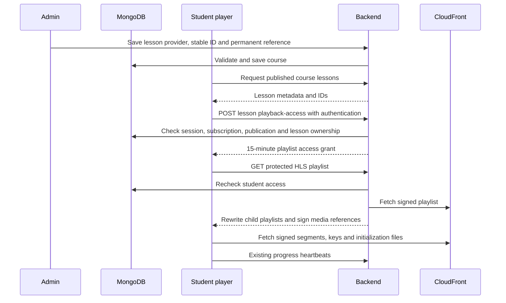

# CloudFront HLS alongside Bunny Stream

## Implemented flow

The React admin course editor retains categories, thumbnails, notes, and draft/publish status. Each lesson selects AWS CloudFront or Bunny Stream. Existing YouTube lessons remain editable for compatibility. Bulk import accepts `1. Title | https://...` or a numbered title followed by its URL on the next line. Numbered entries are sorted before appending. Reorder controls preserve saved lesson IDs. Preview uses administrator authorization and never records student progress.

Permanent AWS references must be HTTPS `.m3u8` URLs from `d2vntxz4x493rp.cloudfront.net`. Capitalization, percent encoding (including trailing `%20`) and query bytes are retained. Literal whitespace, foreign hosts, credentials, fragments and expiring signing parameters are rejected. Encode literal asterisks as `%2A`. Bunny embed/play/CDN validation remains separate; older Bunny documents infer their provider.



The existing React custom player handles AWS through bundled, lazy-loaded `hls.js` (pinned in package-lock) or native HLS on Safari. Bunny keeps its existing playback path. The playlist comes from saved lessons. Grants renew one minute before expiration and playback restores its position. Expo's existing native player also requests grants for active AWS lessons; device verification remains required.

Lesson ordering no longer changes the completion version hash. Stable video IDs map coverage/resume to the same lesson after reordering. Content or duration changes still change the completion version. Legacy index-based Lesson records are bound to video IDs before course edits; removed lessons fail lookup instead of pointing at a replacement. No database-wide migration is run. A saved internal completion order preserves the original hash ordering when the display order is edited, including older courses. Admins must enter accurate durations for the existing 90% coverage rule.

## Backend environment

Add to **edunex-b** only (never Vite/Expo public environment):

```dotenv
CLOUDFRONT_DISTRIBUTION_HOST=d2vntxz4x493rp.cloudfront.net
CLOUDFRONT_ACCESS_MODE=private
CLOUDFRONT_PUBLIC_KEY_ID=
CLOUDFRONT_PRIVATE_KEY=
```

`CLOUDFRONT_PRIVATE_KEY` is the RSA PEM private key corresponding to a public key in a trusted CloudFront key group. Literal `\n` sequences are accepted for environment managers. Use the existing strong `JWT_SECRET` for backend playback grants. Missing signing keys fail closed with an actionable 503. Private is the default. `public` is an explicit option only for intentionally public distribution assets; application authorization cannot prevent direct access to public objects.

No signing key or signed playback URL is stored in course documents. Playlist responses are `Cache-Control: no-store`. Treat playlist grants and signed URLs as short-lived bearer credentials: redact their query strings from API/CDN/error/analytics logs. Already-issued media signatures remain usable until their 15-minute expiry, even if access is revoked sooner; new playlist requests recheck access.

## Production routing and AWS setup still required

The web client calls same-origin `/api`. Configure production hosting/reverse proxy to forward `/api/*` to edunex-b, preserving query strings, content type and no-store headers. A Vite development proxy is not a production solution. If the admin uses `window.EDUNEX_ADMIN_API_BASE`, its preview resolves the grant against that API origin; configure backend CORS for that admin origin too. Expo uses `EXPO_PUBLIC_API_BASE`. Do not deploy the older `appcopyai/backend` in place of edunex-b for these endpoints.

Repository configuration currently identifies local app origins `http://localhost:5173` and `http://127.0.0.1:5173`. The mobile app defaults its public website link to `https://edunexmvp.netlify.app`; that is a candidate deployment origin, not proof of the final admin/student domains. No separate production admin origin is confirmed. Set exact deployed origins in the backend's existing `FRONTEND_ORIGINS` and the CloudFront response headers policy after confirming hosting domains.

For the video cache behavior(s), configure:

- CORS allowed origins: the exact production student and admin origins, plus the two local origins only when local testing is desired. Scheme and port matter; do not include URL paths.
- Methods: GET, HEAD, OPTIONS. Allow required request headers such as Range (and Content-Type/Origin if requested). Expose Accept-Ranges, Content-Range, Content-Length and ETag. Signed URLs do not require credentialed cookies; keep credentials disabled.
- Attach a CloudFront response headers policy consistently to master/variant playlists, audio, segments, initialization files and encryption keys. Ensure OPTIONS/preflight behavior works if requested. Avoid conflicting origin-provided CORS headers; use the response policy's origin override as appropriate.
- Require trusted-key-group signed access on **all** private video behaviors, not only `.m3u8`. Protect the underlying storage/origin from direct public bypass (for S3, use the distribution's origin access control and matching bucket policy).
- Ensure the key-group public key matches the backend private key. This code uses RSA canned-policy signatures for exact resource URLs, including original query parameters.

All lesson resources must remain beneath the master playlist directory on the configured distribution. External key servers, sibling-directory escapes, redirects, DRM license flows and HLS variable substitution are not supported. This phase targets already-processed VOD; no upload or transcoding is implemented. Playlists are limited to 1 MB and a 10-second upstream timeout. For very long/live playback or nonstandard HLS packaging, validate compatibility before release.

AWS references: [signed URL/cookie selection](https://docs.aws.amazon.com/AmazonCloudFront/latest/DeveloperGuide/private-content-choosing-signed-urls-cookies.html), [canned-policy signing](https://docs.aws.amazon.com/AmazonCloudFront/latest/DeveloperGuide/private-content-creating-signed-url-canned-policy.html), [response headers policies](https://docs.aws.amazon.com/AmazonCloudFront/latest/DeveloperGuide/understanding-response-headers-policies.html). No AWS infrastructure was changed.

## Verification record and release checks

Automated: 64 tests passed across CloudFront, certification, authentication navigation, OTP, billing, admin maintenance/health and AI. CloudFront tests exercise exact URL preservation; draft creation/serialization/rehydration/edit/reorder/publish model validation; Bunny inference; exact-resource cryptographic verification; nested playlists/keys/media signing; out-of-scope rejection; bounded fetches; bulk import; subscription/ownership middleware; and coverage/resume after reorder. These are isolated fixtures and route harnesses, not proof of a persisted production course or a played video. Frontend production build and Expo JSX parsing pass.

Browser automation could not connect in this session. Real CloudFront credentials and a playable lesson reference were not supplied for verification. Remaining acceptance checks:

1. Configure AWS/key group/CORS and backend environment, restart edunex-b, open admin course editor.
2. Save a draft with an exact encoded AWS URL and a Bunny lesson; close/reopen, compare the saved URL byte-for-byte, reorder/remove/add, and preview both providers.
3. Publish and verify active/trial learners can play; anonymous, expired, foreign-lesson and unpublished-course requests must fail.
4. Play through a grant renewal; check pause/resume, seeking, playback rate, quality changes, next lesson and saved progress after reload. Seeking alone must not complete lessons.
5. Check Chrome/Android HLS and Safari/iPhone native HLS, portrait/landscape/fullscreen, and Expo on real devices. Verify media/key requests return valid CORS headers without a Vite proxy.
6. Confirm accurate lesson durations and certificate eligibility at 90% coverage of every lesson. Verify existing Bunny courses and retained thumbnails/notes.

Local backend smoke check after restart: `/api/health` 200; authenticated `/api/admin/video-providers` 200 with the configured distribution and private mode; unauthenticated preview 401; authenticated AWS preview 503 with the expected missing signing-key message. This confirms the new routes are running and fail closed; no AWS request or persistent course mutation was performed by these checks. Background jobs remain disabled for local testing.

## Faster course entry

Paste one permanent URL per line in **Paste lesson URLs**, then choose **Import & detect durations**. Display titles come from the filename, or the parent folder for master/playlist/index manifests. Encodings are decoded only in titles; permanent URLs remain byte-for-byte unchanged. Numbered filenames/folders sort numerically; unnumbered entries retain input order after numbered entries. Existing numbered title + URL imports remain supported. Duplicate URLs in the import or existing form are rejected before adding lessons.

The admin-only `POST /api/admin/video-metadata` reads AWS VOD playlists through the existing scoped, signed access service, follows the first video variant (up to four levels), and sums EXTINF durations. Live/unfinished playlists fail with a manual-entry message. Bunny uses the configured library's read-only [Get Video API](https://docs.bunny.net/reference/video_getvideo) and its `length` field. No new environment variables are required. Three client checks run at a time; failures appear on their lesson and can be retried with **Detect all durations / retry checks**. Editable fields are protected against stale results after URL/provider changes, removal or manual duration edits. A readable playlist or metadata response is not proof that all media can play; use Preview before publishing.

Category and notes are entered once at course level. Empty lesson thumbnail overrides inherit the course thumbnails at display time; optional topics, thumbnails, prompts and descriptions live under **Advanced**. Existing thumbnails matching the course default are treated as inherited when reopened in the editor. Saving a draft does not depend on metadata checks succeeding.

Verification for this improvement: 36 targeted tests pass, including six new import/metadata tests. Frontend production build passes. Browser/device playback is still not verified in this environment. Autosave, course duplication, drag-and-drop and S3 folder browsing remain future enhancements.

## Custom AWS course player

`src/components/media/CourseMediaPlayer.jsx` is the shared native-media player used by `VideosPage.jsx` for AWS and direct Bunny HLS lessons. It recreates the sandbox's black video surface and red timeline in Skillomate's component structure. Scoped `player.css`, small SVG controls, and `playerRules.js` keep it separate from the Bunny player and global application styles. It contains no sandbox URLs, source input, statistics, or provider branding.

The existing course API supplies lesson data and stable IDs. The existing sidebar now has a show/hide control; previous/next and automatic progression stop at course boundaries and unavailable lessons. Current backend entitlement remains subscription-based; no new sequential unlocking policy was introduced. AWS source grants still come exclusively from the authenticated backend. Native HLS is used when supported; otherwise the existing bundled hls.js loader handles adaptive playback. Native HLS quality is browser-managed. Captions appear only when selectable tracks are available; burned-in captions cannot be toggled.

Controls include play/pause, 10-second seeking, volume, elapsed/total time, quality, speed, loop, sleep timer, supported PiP and fullscreen. Controls remain visible while paused, settings are open or keyboard focus is visible. Loop suppresses auto-next. Sleep timer pauses the current lesson and is cleared on lesson change/unmount. Playback speed/loop/quality settings are local to the mounted lesson player; quality and caption selection reset to automatic/off when a fresh grant reloads the source. Position and play/pause state survive grant renewal. Browser autoplay restrictions show a press-play notice.

Progress continues through `useLearningProgress` and unchanged server coverage rules; hidden-page and page-exit events also attempt a keepalive flush. Completion is not granted by clicking next or receiving an ended event. HLS instances, event listeners and timers are cleaned up, stale source work is ignored, and decoder recovery is bounded before offering retry.

### Verification on this implementation

- 16 React component tests passed (`npm run test:player` in edunex-f). Tests use jsdom and mocked media APIs/HLS; they verify lifecycle and controls, not real video decoding.
- 30 backend/import/certification/auth-navigation tests passed. Frontend production build passed; the existing lazy hls.js chunk-size warning remains.
- Read-only live checks of one sandbox reference: unsigned CloudFront master **200**, variant **200**, media HEAD **200**. **These assets remain public.** Application authorization alone does not protect those direct URLs.
- CloudFront master/media responses had no `Access-Control-Allow-Origin` for `http://localhost:5173`. Configure the distribution's response headers policy for local testing and exact deployed app origins. No infrastructure was changed.
- Local anonymous playback-access request **401**; invalid playlist grant **401**; authenticated admin preview grant **200**; backend signed playlist delivery **200**. This verifies playlist delivery, not browser media playback or end-to-end private distribution enforcement.
- Browser automation failed to connect. Desktop/mobile visual layout, actual quality/caption decoding, Safari/iOS fullscreen and device PiP still require browser/device verification after CORS setup. Signed playback should also be retested after restricting every video behavior to the trusted key group and verifying the S3 origin cannot be accessed directly.

### Shared controls for existing Bunny courses

The existing page/sidebar now selects the custom controls for Bunny HLS as well as AWS, using the API-provided source. Provider labels and stored references are unchanged. Embed-only/YouTube lessons retain compatible playback. On Bunny direct-stream errors, **Use compatible player** forces the existing embed path instead of retrying the blocked CDN URL. AWS still exclusively uses backend playback grants.

Read-only checks of all five existing lessons in “100 Days of AI Basics By Dhruv Rathee” returned HTTP 403 for the generated Bunny playlists (CORS `*`). Full native custom playback for that course is therefore not verified and requires valid Bunny direct-stream access, or real AWS references for those lessons. No course data, provider settings, or infrastructure was modified. 19 player component tests and production build passed; live browser rendering remains unverified.


## Course and playback startup optimization

The web watch page now loads the authenticated lessons endpoint directly. Its
existing session and stored subscription-expiry middleware remains authoritative;
course startup no longer calls the Razorpay reconciliation endpoint first.
Checkout verification, webhooks and explicit subscription-status requests retain
provider reconciliation. Failed course requests show a retryable error; only an
explicit 403 redirects to payment.

`GET /api/courses/:id/lessons?playback=<index-or-lesson-id>` optionally includes a
15-minute playback grant for the selected CloudFront lesson, after the same
subscription and published-course checks. Responses remain private/no-store with
no-referrer. The player consumes that grant immediately and renews it before
expiry. Other lessons and old backend responses use a bounded authenticated
playback request without depending on the legacy-script runtime.

Playback requests use smaller projections and parallel independent entitlement
and course reads. Each playlist request still rechecks the current session,
subscription, published lesson and original video reference. The backend reuses
its parsed RSA key and avoids signing a throwaway URL when issuing a grant;
segment signatures and expiry are unchanged. No authorization result is cached.

Both frontend and backend must be deployed for the combined startup path. No
video objects or CloudFront access policies are changed. Isolated tests cover
bundled-grant renewal/retry, expiry, course selection and session revocation; a
local 60-segment signing microbenchmark improved from approximately 34 ms to
19 ms. This is not an end-to-end playback-time measurement. Browser verification
was blocked by the browser runtime in this session; real-device timings remain
part of rollout verification.
